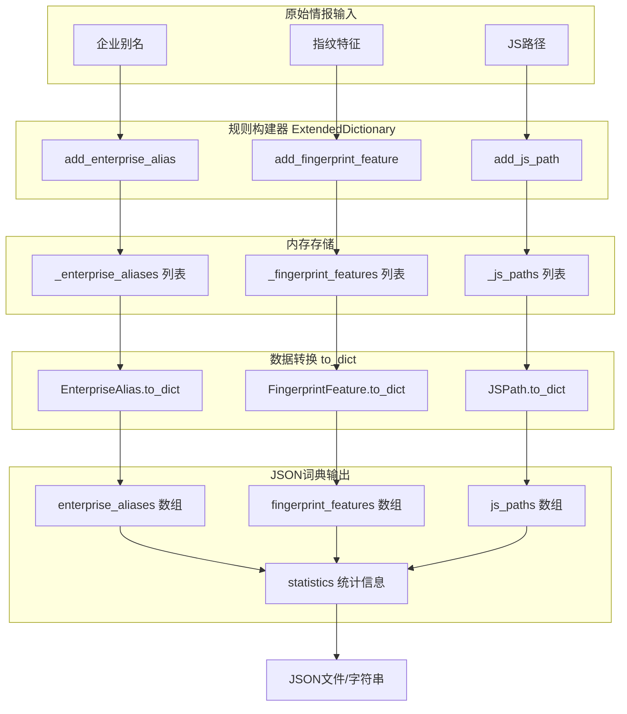
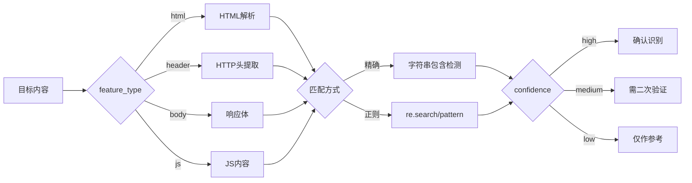

# 扩展词典模块

## 一、模块任务描述
> 本模块旨在将零散的情报转化为标准化的扫描规则，能够支持自定义资产识别、提高扫描针对性。

### 1.1 输入输出
- **主要输入**：
    - 企业别名
    - 指纹特征
    - JS 路径
- **输出**：`scan_dictionary.json`

## 1.2 数据结构
| 字段名 | 类型 | 说明 | 示例 |
| :--- | :--- | :--- | :--- |
| company | String | 企业别名 | "Baidu" |
| product | String | 产品名称 | "UEditor" |

## 1.3 核心逻辑
1. 读取输入数据
2. 调用 `ExtendedDictionary` 类
3. 生成 JSON 文件

- JSON实例

```python
from app.utils.Dynamic Dictionary Agent import ExtendedDictionary

# 创建词典实例
dictionary = ExtendedDictionary()

# 添加企业别名
dictionary.add_enterprise_alias(
    name="阿里巴巴",
    aliases=["阿里", "alibaba", "aliyun"],
    description="阿里巴巴集团"
)

# 添加指纹特征
dictionary.add_fingerprint_feature(
    name="WordPress",
    pattern="wp-content",
    feature_type="html",
    confidence="high"
)

# 添加JS路径
dictionary.add_js_path(
    path="/static/js/app.js",
    name="主应用JS",
    tags=["frontend", "main"]
)

# 导出为JSON
json_str = dictionary.export_to_json("scan_dictionary.json")
```

## 二、代码处理流程

### 2.1 Mermaid流程图

### 2.2 文字概述

| 阶段 | 说明 |
| :---: | :---: |
| 原始情报输入 | 三种数据源：企业别名（名称+别名列表）、指纹特征（名称+匹配模式）、JS路径（路径+标签） |
| 规则构建器 | ExtendedDictionary 类提供 add_* 方法接收原始数据，创建对应的 dataclass 对象 |
| 内存存储 | 使用三个独立列表分别存储不同类型条目，支持增删查操作 |
| 数据转换 | 每个 dataclass 的 to_dict() 方法将对象序列化为字典结构 |
| JSON词典 | export_to_json() 聚合所有数据，添加版本号、时间戳、统计信息，输出为标准JSON |
---

## 三、关键算法分析

### 3.1 JS路径处理

#### 3.1.1 特殊字符转义

```python
@classmethod
def escape_special_chars(cls, path: str) -> str:
    """将路径转换为可用于正则匹配的转义模式"""
    return re.escape(path)
```
- 使用 re.escape() 自动转义正则特殊字符 .^$*+?{}[]|()

#### 3.1.2 路径规范化
```python
@classmethod
def normalize_path(cls, path: str) -> str:
    """统一路径格式，处理多余斜杠、点号引用等"""
```
- 合并连续斜杠 /// → /
- 处理 . 和 .. 目录引用
- 保留路径开头的 / （绝对路径标识）

#### 3.1.3 相对/绝对路径区分

```python
@classmethod
def detect_path_type(cls, path: str) -> str:
    """判断路径类型：absolute/relative/url"""
```
| 路径示例 | 返回类型 |
| :---: | :---: |
| /static/js/app.js | absolute |
| ../lib/utils.js | relative |
| //cdn.example.com/app.js | url |
---

#### 3.1.4 URL编码处理
```python
@classmethod
def url_encode_path(cls, path: str) -> str:
    """对路径进行URL编码，保留安全字符"""
```
- 保留安全字符： / , - , _ , ~ , .
- 支持完整URL编码（含查询参数）

- 使用示例
```python
from app.utils.Dynamic Dictionary Agent import ExtendedDictionary, JSPathProcessor

# 方式1：通过词典添加（自动处理）
dictionary = ExtendedDictionary()
entry = dictionary.add_js_path(
    path="/static/js/app[1].js?version=2.0",
    name="主应用JS",
    tags=["frontend"]
)

print(f"原始路径: {entry.path}")
print(f"规范化: {entry.normalized_path}")
print(f"路径类型: {entry.path_type}")
print(f"转义模式: {entry.escaped_pattern}")
print(f"URL编码: {entry.url_encoded}")
print(f"是否有效: {entry.is_valid}")

# 方式2：单独使用处理器
result = JSPathProcessor.process("/api/../static/./js/app.js")
# result["normalized_path"] -> "/static/js/app.js"
# result["path_type"] -> "absolute"
```
- 输出示例
```python
{
  "path": "/static/js/app[1].js?version=2.0",
  "name": "主应用JS",
  "normalized_path": "/static/js/app[1].js",
  "path_type": "absolute",
  "escaped_pattern": "/static/js/app\$$1\$$\\.js\\?version=2\\.0",
  "url_encoded": "/static/js/app%5B1%5D.js%3Fversion%3D2.0",
  "is_valid": true,
  "validation_errors": []
}
```

### 3.2 指纹匹配策略
- 模式存储，匹配策略由消费方决定
```python
@dataclass
class FingerprintFeature:
    name: str
    pattern: str              # 匹配模式（正则表达式或字符串）
    feature_type: str = "html"  # 特征类型
    confidence: str = "medium"  # 置信度标识
```
| 匹配类型 | 说明 | 使用场景 |
| :---: | :---: | :---: |
| 精确匹配 | pattern 为纯字符串，如 "wp-content" | 高置信度特征 |
| 正则匹配 | pattern 为正则表达式，如 "<meta name=\"generator\" content=\"WordPress.*\">" | 灵活特征识别 |
| 模糊匹配 | 通过 confidence 字段标识置信度 | 降低误报率 |
---
- 匹配流程示意图


### 3.3 数据结构设计
```plaintext
ExtendedDictionary
├── _enterprise_aliases: list[EnterpriseAlias]
│   └── EnterpriseAlias
│       ├── name: str          # 主名称
│       ├── aliases: list[str] # 别名列表
│       └── description: str   # 描述
│
├── _fingerprint_features: list[FingerprintFeature]
│   └── FingerprintFeature
│       ├── name: str           # 特征名
│       ├── pattern: str        # 匹配模式
│       ├── feature_type: str   # html/header/body/js
│       └── confidence: str     # high/medium/low
│
└── _js_paths: list[JSPath]
    └── JSPath
        ├── path: str          # 路径
        ├── name: str          # 标识名
        └── tags: list[str]    # 分类标签
```

## 四、总结
| 模块 | 当前能力 |
| :---: | :---: |
| JS路径 | 原始存储 |
| 指纹匹配 | 模式存储 + 置信度标识 |
| 数据导出 | 完整JSON序列化 |