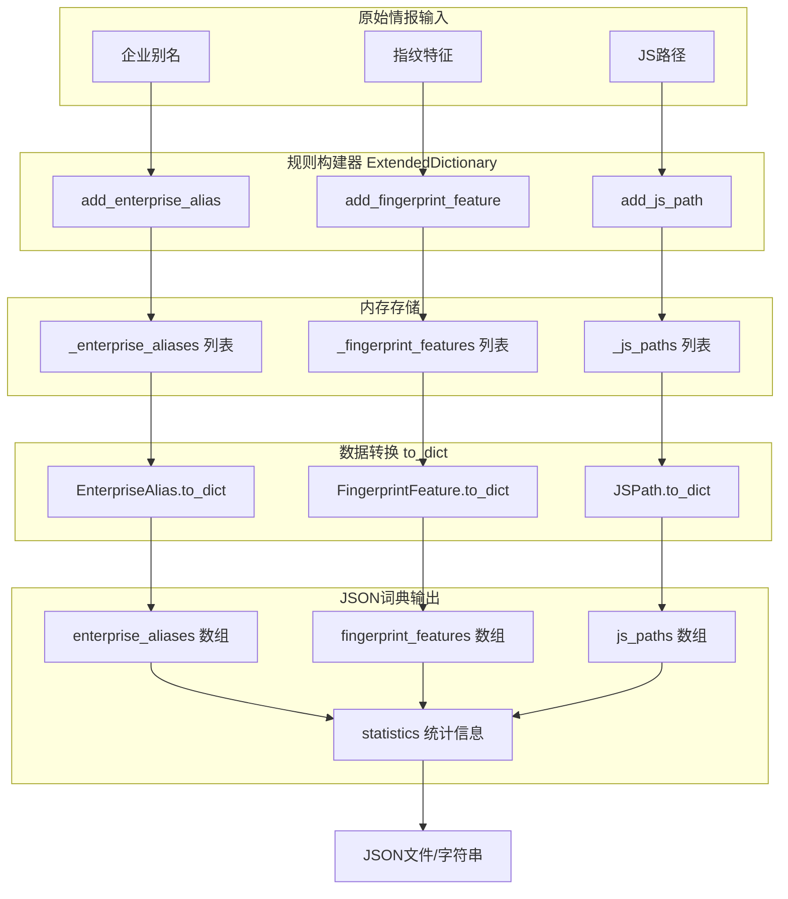
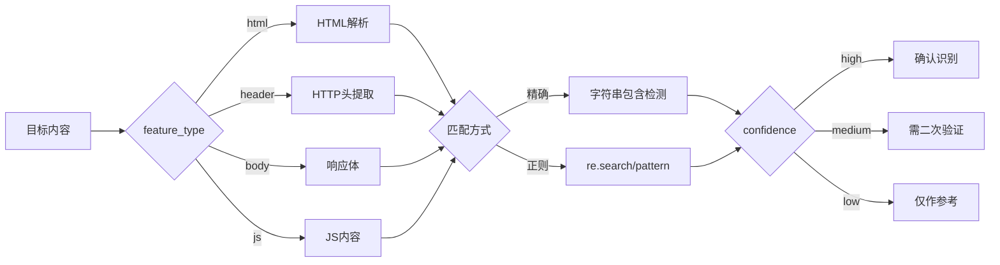

# 一、模块任务描述
> 本模块旨在将零散的情报转化为标准化的扫描规则，能够支持自定义资产识别、提高扫描针对性，主要提供三种核心数据类型的标准化存储与处理：

| 数据类型 | 应用场景 | 核心价值 |
| :---: | :---: | :---: |
| 企业别名 | 资产归属识别 | 统一企业多名称关联 |
| 指纹特征 | 技术栈识别 | 标准化CMS/框架匹配规则 |
| JS路径 | 敏感信息探测 | 路径规范化与智能匹配 |

## 1.1 输入输出目标

### 1.1.1 输入目标
- 企业别名的核心输入目标是实现企业实体的多名称归一化映射，要求名称准确无歧义，别名覆盖度高。
- 指纹特征的核心输入目标是建立Web技术栈识别的标准化规则库，要求模式唯一性强，误报率处于可控范围。
- JS路径的核心输入目标是构建敏感JS文件探测的路径字典，要求路径有效性高，能够覆盖主流框架的特征路径。

### 1.1.2 输出目标
- 结构化JSON输出，生成符合扫描器标准的词典格式，包含版本号、导出时间戳、分类数据数组以及统计信息。
- JS路径增强输出，每条JS路径附带五项增强字段：规范化路径、路径类型标识、正则转义模式、URL编码结果以及有效性验证标记。
- 元数据伴随输出，每条条目自动携带创建时间戳，支持数据溯源和版本追踪。
- 统计信息自动输出，包含各类条目的数量以及总条目数，便于扫描器评估词典规模和加载策略。

### 1.1.3 输入输出
- **主要输入**：
    - 企业别名
    - 指纹特征
    - JS 路径
- **输出**：`scan_dictionary.json`

## 1.2 数据结构
| 字段名 | 类型 | 说明 | 示例 |
| :--- | :--- | :--- | :--- |
| company | String | 企业别名 | "Baidu" |
| product | String | 产品名称 | "UEditor" |

## 1.3 核心逻辑
1. 读取输入数据
2. 调用 `ExtendedDictionary` 类
3. 生成 JSON 文件

- JSON实例

```python
from app.utils.Dynamic Dictionary Agent import ExtendedDictionary

# 创建词典实例
dictionary = ExtendedDictionary()

# 添加企业别名
dictionary.add_enterprise_alias(
    name="阿里巴巴",
    aliases=["阿里", "alibaba", "aliyun"],
    description="阿里巴巴集团"
)

# 添加指纹特征
dictionary.add_fingerprint_feature(
    name="WordPress",
    pattern="wp-content",
    feature_type="html",
    confidence="high"
)

# 添加JS路径
dictionary.add_js_path(
    path="/static/js/app.js",
    name="主应用JS",
    tags=["frontend", "main"]
)

# 导出为JSON
json_str = dictionary.export_to_json("scan_dictionary.json")
```
# 二、边界、约束与默认策略

## 2.1 模块边界
### 2.1.1 模块负责的边界包括三个层面：
- 数据层面负责数据结构化存储、JS路径四阶预处理以及JSON序列化和反序列化。
- 业务层面负责条目的增删查操作、数据的导入导出以及旧版本数据兼容处理。
- 持久层面负责文件级JSON读写。

### 2.1.2 模块不负责的边界同样分为三层：
- 数据层不做HTTP请求发送、页面内容爬取以及实时匹配引擎。
- 业务层不实现特征匹配算法、扫描任务调度以及扫描结果去重。
- 持久层不提供数据库ORM、分布式同步机制以及增量更新功能。

## 2.2 核心约束条件
- 数据规模约束，企业别名推荐数量上限为10000条，指纹特征推荐5000条，JS路径推荐100000条，超过阈值会出现性能下降。
- 字段长度约束，所有字段默认不做截断处理，由调用方保证数据质量，JS路径建议控制在2000字符以内符合URL标准。
- 字符集约束，所有字段使用UTF-8编码，路径字段兼容URL编码，JSON序列化时保留中文字符不转义。
- 正则表达式约束，指纹特征的pattern字段语法正确性由调用方保证，模块不做正则语法校验，JS路径转义仅保证字面匹配正确性。

## 2.3 默认策略配置

**默认策略主要包括以下内容：**

- JS路径空白字符自动去除首尾空白，连续斜杠自动合并为单斜杠。
- 目录遍历符号会自动解析并规范化。
- URL编码时保留的安全字符包括斜杠、横杠、下划线、波浪线和点号。- JSON导出默认缩进为2空格。导入旧版本数据时会自动对JS路径进行重新处理。
- 所有条目创建时间自动使用ISO 8601格式。指纹特征默认类型为html，默认置信度为medium。路径类型默认为relative，添加时自动检测实际类型。

## 2.4 异常处理策略
- 空路径输入会标记为无效路径并记录错误信息。无效JSON导入抛出原生异常。移除不存在的条目返回False布尔值。
- 允许添加重复条目，调用方自行负责去重。
- 正则特殊字符在escaped_pattern字段自动转义。包含目录遍历的路径自动规范化并在validation_errors中给出警告。

# 三、职责拆解
## 3.1 核心职责
### 3.1.1 数据建模
- 将扫描领域的三类核心情报抽象为独立的数据类，通过dataclass建立强类型契约，确保字段完整语义清晰。
- 为三类条目建立隐式关联能力，可通过标签或名称进行关联查询。每个数据项自动携带创建时间、验证状态等元数据，支持全流程可追溯可审计。

### 3.1.2 标准化处理
- 实现JS路径的四阶标准化处理流水线，包含特殊字符转义、路径规范化、路径类型判定、URL编码四个环节，确保相同语义的不同输入能够产生相同的标准化结果。
- 统一所有输出字段命名和结构，对v0.x格式数据自动升级，对输入数据进行有效性评估和标记，使脏数据能够被识别过滤。

### 3.1.3 序列化管理
- 完整导出JSON结构，包含元数据与统计信息，确保导入导出数据无损。
- 通过版本号机制支持后续字段扩展，JSON序列化时保留中文字符不转义，确保人类可读。文件导出采用原子写入策略，确保写入失败不损坏原有文件。

### 3.1.4 接口契约保障
- 维持add、remove、get系列方法命名风格统一，降低使用者的学习成本。为每个公共方法提供完整类型注解，确保IDE提示友好。
- 返回值语义明确，布尔返回值含义清晰，没有隐含的失败路径。所有公共方法包含完整的docstring文档，通过help函数即可查阅。

### 3.1.5 可扩展性设计
- JSPathProcessor设计为可独立组件，能够脱离ExtendedDictionary单独使用，支持按需导入。
- feature_type采用开放的字符串枚举，支持新增html、js、header之外的类型。
- 新增字段不影响原有导入逻辑，保持向后兼容。数据层与匹配层完全分离，替换匹配算法无需修改词典模块。

## 3.2 非职责
**本模块明确不承担以下职责，所有超出以下范围的功能均属于非职责边界。**

- 不实现匹配引擎。本模块仅提供特征数据存储，不实现正则匹配、字符串搜索等具体的匹配算法，匹配逻辑由上层扫描引擎负责。

- 不处理网络IO。不包含任何HTTP请求发送、页面内容爬取、远程资源下载等网络操作。

- 不提供并发控制。本模块设计为非线程安全，并发场景下的锁机制由调用方自行实现。

- 不实现数据库持久化。仅支持文件级JSON读写，不提供任何数据库ORM集成、关系型数据持久化功能。

- 不提供权限控制。没有任何数据访问权限校验、用户身份认证的机制。

- 不实现匹配评分算法。置信度字段仅作为元数据标记，具体的匹配结果评分算法由扫描引擎实现。

# 四、代码处理流程

## 4.1 Mermaid流程图

## 4.2 文字概述

| 阶段 | 说明 |
| :---: | :---: |
| 原始情报输入 | 三种数据源：企业别名（名称+别名列表）、指纹特征（名称+匹配模式）、JS路径（路径+标签） |
| 规则构建器 | ExtendedDictionary 类提供 add_* 方法接收原始数据，创建对应的 dataclass 对象 |
| 内存存储 | 使用三个独立列表分别存储不同类型条目，支持增删查操作 |
| 数据转换 | 每个 dataclass 的 to_dict() 方法将对象序列化为字典结构 |
| JSON词典 | export_to_json() 聚合所有数据，添加版本号、时间戳、统计信息，输出为标准JSON |
---

# 五、关键算法分析

## 5.1 JS路径处理
```python
@dataclass
class JSPath:
    path: str                    # 原始路径
    name: str                    # 路径标识名
    description: str             # 描述
    tags: list[str]              # 分类标签
    created_at: str              # 创建时间
    
    # 处理器增强字段
    normalized_path: str         # 规范化路径
    path_type: str               # 路径类型
    escaped_pattern: str         # 转义正则模式
    url_encoded: str             # URL编码结果
    is_valid: bool               # 有效性标记
    validation_errors: list[str] # 错误信息
```
**路径类型**：

- absolute - 绝对路径（以 / 开头）
- relative - 相对路径
- url - 完整URL或协议相对路径
### **四大核心特性：**

### 5.1.1 特殊字符转义

```python
@classmethod
def escape_special_chars(cls, path: str) -> str:
    """将路径转换为可用于正则匹配的转义模式"""
    return re.escape(path)
```
**处理逻辑**：

- 调用Python标准库 re.escape()
- 自动转义所有正则特殊字符 .^$*+?{}[]|()
- 转义后的路径可直接用于正则匹配

### 5.1.2 路径规范化
```python
@classmethod
def normalize_path(cls, path: str) -> str:
    """统一路径格式，处理多余斜杠、点号引用等"""
```
- 处理步骤：

1. 空白清理 ：移除首尾空白字符
2. 斜杠合并 ： /// → /
3. 点号解析 ：
   - ./ → 移除当前目录引用
   - ../ → 向上一级目录
4. 格式保留 ：维持原始的绝对/相对标识

- 示例：

| 输入 | 输出 | 说明 |
| :---: | :---: | :---: |
| /api/../static/./js/app.js | /static/js/app.js | 目录回溯 |
| ///a//b/c/// | /a/b/c/ | 斜杠合并 |
---

### 5.1.3 相对/绝对路径区分

```python
@classmethod
def detect_path_type(cls, path: str) -> str:
    """判断路径类型：absolute/relative/url"""
```
- 判定规则：

| 路径示例 | 返回类型 |
| :---: | :---: |
| /static/js/app.js | absolute |
| ../lib/utils.js | relative |
| //cdn.example.com/app.js | url |
---

### 5.1.4 URL编码处理
```python
@classmethod
def url_encode_path(cls, path: str) -> str:
    """对路径进行URL编码，保留安全字符"""
```
>安全字符列表： / , - , _ , ~ , .

- 处理策略：

1. 完整URL：分别编码路径和查询参数
2. 相对路径：安全字符不编码，其他编码
3. 保留 & 和 = 在查询参数中

- 使用示例
```python
from app.utils.Dynamic Dictionary Agent import ExtendedDictionary, JSPathProcessor

# 方式1：通过词典添加（自动处理）
dictionary = ExtendedDictionary()
entry = dictionary.add_js_path(
    path="/static/js/app[1].js?version=2.0",
    name="主应用JS",
    tags=["frontend"]
)

print(f"原始路径: {entry.path}")
print(f"规范化: {entry.normalized_path}")
print(f"路径类型: {entry.path_type}")
print(f"转义模式: {entry.escaped_pattern}")
print(f"URL编码: {entry.url_encoded}")
print(f"是否有效: {entry.is_valid}")

# 方式2：单独使用处理器
result = JSPathProcessor.process("/api/../static/./js/app.js")
# result["normalized_path"] -> "/static/js/app.js"
# result["path_type"] -> "absolute"
```
- 输出示例
```python
{
  "path": "/static/js/app[1].js?version=2.0",
  "name": "主应用JS",
  "normalized_path": "/static/js/app[1].js",
  "path_type": "absolute",
  "escaped_pattern": "/static/js/app\$$1\$$\\.js\\?version=2\\.0",
  "url_encoded": "/static/js/app%5B1%5D.js%3Fversion%3D2.0",
  "is_valid": true,
  "validation_errors": []
}
```

## 5.2 指纹匹配策略
- 模式存储，匹配策略由消费方决定
```python
@dataclass
class FingerprintFeature:
    name: str
    pattern: str              # 匹配模式（正则表达式或字符串）
    feature_type: str = "html"  # 特征类型
    confidence: str = "medium"  # 置信度标识
```
| 匹配类型 | 说明 | 使用场景 |
| :---: | :---: | :---: |
| 精确匹配 | pattern 为纯字符串，如 "wp-content" | 高置信度特征 |
| 正则匹配 | pattern 为正则表达式，如 "<meta name=\"generator\" content=\"WordPress.*\">" | 灵活特征识别 |
| 模糊匹配 | 通过 confidence 字段标识置信度 | 降低误报率 |
---
- 匹配流程示意图


## 5.3 数据结构设计
```plaintext
ExtendedDictionary
├── _enterprise_aliases: list[EnterpriseAlias]
│   └── EnterpriseAlias
│       ├── name: str          # 主名称
│       ├── aliases: list[str] # 别名列表
│       └── description: str   # 描述
│
├── _fingerprint_features: list[FingerprintFeature]
│   └── FingerprintFeature
│       ├── name: str           # 特征名
│       ├── pattern: str        # 匹配模式
│       ├── feature_type: str   # html/header/body/js
│       └── confidence: str     # high/medium/low
│
└── _js_paths: list[JSPath]
    └── JSPath
        ├── path: str          # 路径
        ├── name: str          # 标识名
        └── tags: list[str]    # 分类标签
```

# 六、测试计划与验收标准

## 6.1 单元测试

| 测试分类 | 测试用例 | 验收标准 |
| :---: | :---: | :---: |
| 新词生成测试 | 正常企业名称生成 | 生成大小写变体、缩写、后缀剥离 |
| | 空名称输入 | 异常捕获/返回空集合 |
| | 纯英文名称生成 | 大小写变体正确生成 |
| | 去重验证 | 集合中无重复项 |
| | auto_add=True 测试 | 生成的别名自动写入词典 |
| 路径扩展测试 | 单路径基础扩展 | 生成目录+扩展名组合 |
| | include_extensions=False | 不生成扩展名变体，只生成单路径 |
| | max_results 限制 | 不超过最大结果数 |
| | 路径规范化验证 | 所有输出路径均经过规范化 |
| | auto_add=True 测试 | 扩展路径自动入库且去重 |
| 增量导入测试 | 完全新增导入 | 所有条目正确添加，计数正确 |
| | 完全重复导入 | 无新增，统计existed计数正确 |
| | 混合增量导入 | 新增/已存在分类统计准确 |
| | 空文件导入 | 无报错，无变更 |
| | 跨版本兼容导入 | v0.x数据自动处理四阶预处理 |
| JS路径处理器测试 | 特殊字符转义 | 正则元字符正确转义 |
| | 路径规范化 | ../ ./ 连续斜杠处理正确 |
| | 路径类型检测 | absolute/relative/url 检测准确 |
| | URL编解码 | 特殊字符编码可还原 |
| | 有效性验证 | 脏路径标记准确 |

## 6.2 集成测试计划

| 场景 | 测试步骤 | 验收标准 |
| :---: | :---: | :---: |
| 端到端流程 | 手动添加条目 → 导出JSON → 清空 → 增量导入 → 再次导出 | 导入导出数据一致 |
| 大数据量性能 | 批量添加10万条JS路径 | 内存<500MB，导出<10秒 |
| 并发写入 | 多线程同时add_js_path（外层加锁） | 数据无丢失，总数正确 |
| 版本兼容 | 无normalized_path字段的旧JSON导入 | 自动完成路径处理 |

## 6.3 验收通过标准
- 功能覆盖率 100% ：所有测试用例全部通过
- 代码质量 ：无语法错误，py_compile验证通过
- 边界条件 ：空值、重复值、异常值处理优雅
- 性能指标 ：10万条数据导入<30秒
- API稳定性 ：所有公共方法参数/返回值类型不变
