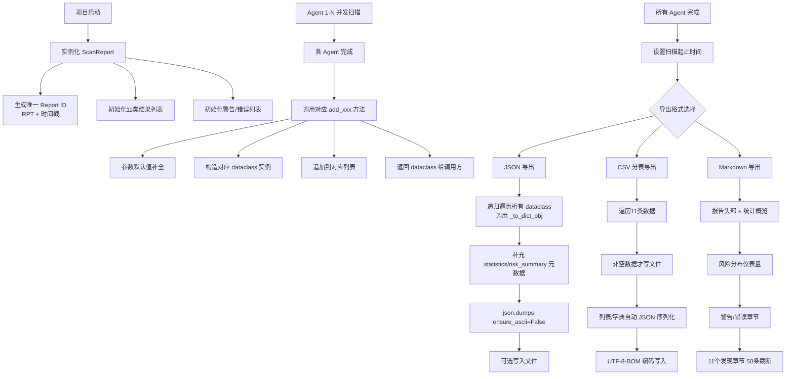

# 一、模块任务描述

>报告输出模块是整个扫描系统的"数据汇流点"和"最终交付物生成器"。它就像整个系统的"大漏斗"：上游11个Agent（企业情报、基础发现、指纹识别...）并行产生的所有异构数据，全部汇入这个模块进行标准化聚合，最终生成 机器可读的JSON、分析师可读的Markdown、以及Excel可编辑的CSV分表 三种交付格式。它的存在让每个Agent只需要关心自己的扫描逻辑，不需要关心输出格式；同时下游的所有消费方（用户、归档系统、可视化平台）也只需要对接这一个标准出口，形成了完美的"关注点分离"。

# 二、核心功能

- 在不干预、不修改上游扫描结果的前提下，提供一个标准化的数据收束点，消除11个Agent的数据格式异构性，提供统一的、可追溯的、多格式的报告交付能力。

## 2.1 输入

- 所有输入全都是数据，没有控制指令
- 上游Agent只负责生产数据，不关心输出格式
- 语义化强类型，每个字段的含义在11个Agent之间统一
- 可追溯：每条数据自带source字段标记来源Agent
- 无强制校验：输入即永久保留，不做任何修改过滤

### 2.1.1 各部分agent调用方法（add_xxx）

- 企业情报Agent：add_enterprise_info()
- 基础发现Agent：add_asset_discovery()
- 指纹识别Agent：add_fingerprint_match()
- JS解析Agent：add_js_analysis()
- 图谱聚合Agent：add_graph_relation()
- 价值评估Agent：add_value_assessment()
- 复核Agent：add_review_item()
- 文件情报Agent：add_file_intel()
- 流量审查Agent：add_traffic_alert()
- 链路提示Agent：add_link_hint()
- 扩展词典Agent：add_dictionary_entry()

- **全局警告与错误输入：**
add_warning() / add_error()

## 2.2 输出

 输出格式 | 目标消费方 | 格式特点 | 典型使用场景 |
| :---: | :---: | :---: | :---: |
| JSON | 机器 | 完整嵌套结构、无信息损失 | 归档入库、二次开发、API返回 |
| CSV分表 | 分析师/Excel | 扁平化、每类数据一个表 | 人工筛选排序、批量复核 |
| Markdown | 人类/阅读者 | 分层结构、仪表盘、截断优化 | 项目交付、快速预览、邮件发送 |
---
### 2.2.1 各格式的设计考量：
**JSON格式设计原则：完整性优先**

- 保留所有嵌套字段，不做任何截断
- 列表数组原样输出，不做扁平化
- 中文不转义，保证可读性

**CSV格式设计原则：Excel兼容性优先**

- 每类Agent一个独立的CSV文件，避免一张表列数爆炸
- 嵌套的列表/字典自动JSON序列化，保证Excel能打开
- 强制UTF-8-BOM编码，解决中文乱码问题

**Markdown格式设计原则：可读性优先**

- 单节超过50条自动截断，避免报告长达几百页
- 长列表超过3项显示省略号+总数
- 空数据的章节自动隐藏，不占版面
- 前置统计概览，不需要翻到最后才知道发现了什么

### 2.2.2 内置统计能力
- 自动计数每类Agent发现条数
- 全局风险分布汇总（Critical/High/Medium/Low/Info）
- 警告/错误独立收集 
### 2.2.3 报告合并
- 支持多报告增量合并： report.merge_report(other_report)

# 三、边界、约束与默认策略

## 3.1 模块边界

| 本模块职责 | 非本模块职责 | 与其他模块的边界 |
| :---: | :---: | :---: |
| 11类Agent输出数据的结构化存储 | 各Agent具体的扫描逻辑实现 | 从11个Agent接收标准化输出 |
| 跨Agent数据的统一聚合与统计 | 扫描任务调度与执行控制 | 不调用其他模块的API |
| JSON/CSV/Markdown三种格式导出 | 前端展示与报表渲染 | 输出给用户/归档系统/前端 |
| 多报告增量合并 | 报告审核与审批流程 | 纯数据输出，不处理工作流 |
| 风险等级全局统计 | PDF/Word格式生成 | 纯文本格式，二进制格式交给其他模块 |
| 警告/错误信息收集 | 实时日志采集 | 本模块只存终态结果，不处理实时流 |
---

## 3.2 硬约束
| 约束类型 | 具体限制 | 说明 |
| :---: | :---: | :---: |
| 内存约束 | 单报告建议 ≤ 10万条 | 超过建议分拆多报告 |
| 截断策略 | Markdown单节超过50条自动截断 | 末尾显示"还有N项未显示" |
| 序列化约束 | 列表/字典自动JSON序列化后写入CSV | 保证Excel兼容 |
| 字符编码 | 强制 UTF-8 / UTF-8-BOM | 避免Excel中文乱码 |
| 字段约束 | 所有枚举值必须匹配 RiskLevel/ConfidenceLevel | 运行时不做强校验，但导出不一致 |
---

## 3.3 默认策略

| 配置项 | 默认值 | 可修改 |
| :---: | :---: | :---: |
| CSV编码 | utf-8-sig（带BOM） |  |
| JSON缩进 | 2空格 | export_json 参数 |
| Markdown截断数 | 50条/节 |  |
| 置信度默认值 | medium | 各add方法参数 |
| 风险等级默认值 | info（指纹）/ medium（其他） | 各add方法参数 |
| 关系权重默认值 | 1.0 | add_graph_relation 参数 |
---

## 3.4 设计原则

### 3.4.1 接口一致性 ：

- dataclass 做领域模型
- 面向对象门面类 ScanReport
- 链式调用返回自身实例

### 3.4.2 枚举标准化 ：

- RiskLevel : 五级风险分级
- ConfidenceLevel : 四级置信度分级

### 3.4.3源标识 ：

- 每个数据项自带 source 字段，明确追溯产生的Agent

# 四、职责拆解

## 4.1 三层架构职责划分

| 层级 | 类名 | 核心职责 |
| :---: | :---: | :---: |
| 枚举层 | RiskLevel , ConfidenceLevel | 全局标准值定义，跨模块统一语义 |
| 领域模型层 | 11个 @dataclass | 数据结构契约定义，每个Agent对应一个实体 |
| 门面层 | ScanReport | 对外API、数据聚合、格式导出 |
---

## 4.2 门面层 ScanReport 职责拆解

| 方法分类 | 具体职责 |
| :---: | :---: |
| 11个 add_xxx 方法 | 标准化接收入口，类型转换、默认值补全、返回dataclass实例 |
| 统计方法 | get_statistics() 全局计数 / get_risk_summary() 风险维度汇总 |
| 导出方法 | export_json() 完整结构 / export_csv() 分表 / export_markdown() 人类可读 |
| 合并方法 | merge_report() 多报告增量追加（无去重，无冲突解决） |

# 五、代码处理流程

## 5.1 Mermaid流程图



## 5.2 关键路径声明

- 无去重设计 ：所有 add 方法纯粹追加，不做存在性判断（去重是各上游Agent的职责）
- 无校验设计 ：运行时不校验枚举值正确性（枚举的意义是文档约束，不是运行时约束）
- 无锁设计 ：多线程并发add需要调用方在外层加锁（本模块假设单线程写入）
- 递归序列化 ： _to_dict_obj 方法通过 __dataclass_fields__ 反射遍历，新增字段无需修改序列化代码

# 六、关键算法分析

## 6.1 通用 dataclass 序列化算法

```python
def _to_dict_obj(self, obj: Any) -> Dict[str, Any]:
    if hasattr(obj, "__dataclass_fields__"):
        result = {}
        for field_name in obj.__dataclass_fields__.keys():
            value = getattr(obj, field_name)
            if isinstance(value, list):
                result[field_name] = [
                    self._to_dict_obj(item) if hasattr(item, "__dataclass_fields__") else item
                    for item in value
                ]
            else:
                result[field_name] = value
        return result
    return obj
```
**算法特点**：

- 零侵入：新增dataclass字段无需修改序列化代码
- 深度递归：支持嵌套dataclass（本模块虽然没用到，但架构支持）
- 列表处理：自动处理dataclass列表
- 不处理字典值中的dataclass（本业务场景不存在）
- 时间复杂度：O(n) n为所有字段总数

## 6.2 风险全局汇总算法

```python
def get_risk_summary(self) -> Dict[str, int]:
    all_risks = []
    for item in self.fingerprint_matches + self.js_analysis + self.file_intel + self.traffic_alerts:
        all_risks.append(item.risk_level)
    return {
        RiskLevel.CRITICAL.value: all_risks.count(RiskLevel.CRITICAL.value),
        RiskLevel.HIGH.value: all_risks.count(RiskLevel.HIGH.value),
        RiskLevel.MEDIUM.value: all_risks.count(RiskLevel.MEDIUM.value),
        RiskLevel.LOW.value: all_risks.count(RiskLevel.LOW.value),
        RiskLevel.INFO.value: all_risks.count(RiskLevel.INFO.value),
    }
```
**算法特点**：

- 4类带风险等级的数据合并统计
- 注意：企业信息、资产发现、图谱关系、价值评估等 无风险属性 ，不参与统计
- 时间复杂度：O(n)，n为所有带风险的发现总数
- 空间优化：本实现是可读性优先写法，可优化为一次遍历计数

## 6.3 CSV 智能序列化算法

```python
if isinstance(value, (list, dict)):
    row[field] = json.dumps(value, ensure_ascii=False)
else:
    row[field] = value
```
**设计考虑**：

- Excel原生不支持嵌套结构
- 自动检测列表/字典，转JSON字符串
- 人类可读： ["a","b","c"] 比默认的 str(['a', 'b', 'c']) 规范
- 下游可还原： json.loads() 即可恢复原始结构

# 七、测试计划与验收标准

## 7.1 单元测试计划

| 测试分类 | 测试用例 | 验收标准 |
| :---: | :---: | :---: |
| 基础功能测试 | 空报告初始化 | Report ID生成规则正确，所有列表为空 |
|  | 设置扫描时间 | 起止时间正确持久化 |
|  | 11类add方法全覆盖 | 每个方法调用后，对应列表长度+1 |
|  | 添加警告/错误 | 时间戳自动追加 |
| 统计功能测试 | 空报告统计 | 全部计数为0 |
|  | 单类数据统计 | 计数与添加数量一致 |
|  | 风险汇总统计 | 各等级计数准确 |
|  | 总发现数公式 | 等于11类数据之和 |
| JSON导出测试 | 嵌套字段序列化 | 所有字段出现在JSON中 |
|  | 中文编码 | ensure_ascii=False，中文正常显示 |
|  | 大字段导出 | 1000字符长字符串无截断 |
|  | 可选写入文件 | 文件存在，内容与内存中一致 |
| CSV导出测试 | 空数据跳过 | 无数据的类别不生成文件 |
|  | 列表字段序列化 | 自动转合法JSON字符串 |
|  | 中文Excel兼容 | 用Excel打开无乱码（BOM头） |
|  | 表头正确性 | 字段名与dataclass定义一致 |
| Markdown导出测试 | 报告头部完整 | 编号、时间、扫描周期正确 |
|  | 统计表格正确 | 行数、计数一致 |
|  | 50条截断机制 | 超过50条显示省略提示 |
|  | 长列表显示优化 | 超过3项显示省略号+总数 |
|  | 空章节不显示 | 无数据的章节自动隐藏 |
| 报告合并测试 | 空+空合并 | 无异常 |
|  | 空+数据合并 | 数据完整迁移 |
|  | 数据+数据合并 | 长度为两者之和 |
|  | 警告错误合并 | 警告错误列表也正确合并 |
---

## 7.2 集成测试计划

| 场景 | 测试步骤 | 验收标准 |
| :---: | :---: | :---: |
| 端到端流程 | 11类Agent各添加1条 → 导出三种格式 → 人工校验 | 所有数据无丢失、无错乱 |
| 大数据量性能 | 连续添加10万条JS分析结果 | 内存<500MB，导出<10秒 |
| 真实数据兼容性 | 导入真实扫描结果JSON → 重新导出 | 无字段遗漏 |
| 跨版本兼容 | 旧版导出的JSON导入本模块 | 新增字段取默认值 |
---

## 7.3 验收通过标准

| 维度 | 通过标准 |
| :---: | :---: |
| 功能覆盖率 | 100% 测试用例通过 |
| 代码质量 | py_compile 验证无语法错误 |
| 导出完整性 | 随机抽样20个字段，100%正确出现在三种格式中 |
| 边界条件 | 空报告导出无报错 |
| 性能指标 | 1万条数据导出<1秒 |
| 向后兼容 | 新增dataclass字段，旧代码导出的JSON重新导入不抛异常 |
| 编码正确性 | 中文在Excel、浏览器、文本编辑器中均无乱码 |
---

# 八、测试用例

```python
import sys
sys.path.insert(0, '.')
from app.utils.Report import ScanReport

report = ScanReport('某集团渗透测试项目')
report.set_scan_time('2026-04-10T09:00:00', '2026-04-10T15:30:00')

report.add_enterprise_info(
    enterprise_name='某科技集团有限公司',
    aliases=['某集团', '某科技'],
    shareholders=['张三', '李四'],
    icp_records=['京ICP备12345678号']
)

report.add_asset_discovery(
    domain='example.com',
    subdomains=['www.example.com', 'api.example.com', 'admin.example.com'],
    ip_addresses=['1.2.3.4', '5.6.7.8'],
    open_ports=[80, 443, 8080, 3306],
    base_paths=['/api', '/admin', '/login']
)

report.add_fingerprint_match(
    target_url='https://example.com',
    technology_name='Spring Boot',
    version='2.7.0',
    category='开发框架',
    risk_level='high'
)

report.add_js_analysis(
    js_path='/app.js',
    endpoints=['/api/user/list', '/api/admin/delete'],
    parameters=['id', 'token', 'password'],
    sensitive_keywords=['admin', 'secret', 'apikey'],
    risk_level='critical'
)

report.add_graph_relation(
    entity_a='example.com',
    entity_b='1.2.3.4',
    relation_type='域名解析',
    evidence=['A记录查询结果']
)

report.add_value_assessment(
    asset_id='ASSET001',
    asset_name='后台管理系统',
    priority_score=95,
    priority_level='P0',
    value_factors={'contains_admin_interface': 30, 'sensitive_data_exposure': 40}
)

report.add_file_intel(
    file_path='/backup.sql',
    file_type='database_dump',
    sensitive_clues=['用户密码哈希', '手机号明文'],
    risk_level='critical'
)

report.add_traffic_alert(
    traffic_sample_id='TF001',
    risk_clue='SQL注入特征',
    affected_endpoints=['/api/search'],
    risk_level='high'
)

report.add_dictionary_entry(
    entry_type='js_path',
    content='/hidden/api/v2/user',
    generation_method='path_extension',
    extended_from='/api/user'
)

report.add_warning('部分子域名连接超时，可能存在WAF拦截')
report.add_warning('高置信度指纹匹配数量低于预期')

stats = report.get_statistics()
print('=' * 60)
print('报告生成成功')
print('=' * 60)
print(f'总发现数: {stats["total_findings"]} 项')
print(f'企业情报: {stats["enterprise_info_count"]}')
print(f'资产发现: {stats["asset_discovery_count"]}')
print(f'指纹识别: {stats["fingerprint_matches_count"]}')
print(f'JS分析: {stats["js_analysis_count"]}')
print(f'图谱关联: {stats["graph_relations_count"]}')
print(f'价值评估: {stats["value_assessments_count"]}')
print(f'文件情报: {stats["file_intel_count"]}')
print(f'流量预警: {stats["traffic_alerts_count"]}')
print(f'词典条目: {stats["dictionary_entries_count"]}')
print()
print('风险统计:', report.get_risk_summary())
print()

json_str = report.export_json()
md = report.export_markdown()
csv_files = report.export_csv('./output')

print(f'JSON导出: {len(json_str)} 字符')
print(f'Markdown导出: {len(md)} 字符')
print(f'CSV导出: {len(csv_files)} 个文件')
for f in csv_files:
    print(f'  - {f}')

print()
print(report)
print()
print('所有功能验证通过!')
```

| 编号 | 测试用例名称 | 覆盖功能点 |
| :---: | :---: | :---: |
| TC01 | 空报告基础功能 | 空值处理、统计初始值、JSON导出 |
| TC02 | 单类数据添加与统计 | 增量计数准确性 |
| TC03 | 五级风险分布统计 | Critical/High/Medium/Low/Info |
| TC04 | JSON导出完整性 | 嵌套字段序列化 |
| TC05 | CSV导出功能 | 文件生成、非空校验 |
| TC06 | Markdown导出格式 | 章节生成、内容完整性 |
| TC07 | 报告合并功能 | 多报告增量合并 |
| TC08 | 警告错误收集 | 全局警告/错误收集 |
| TC09 | 11类Agent全覆盖 | 所有数据结构定义 |
| TC10 | dataclass的source字段 | 数据源追溯标记 |
---