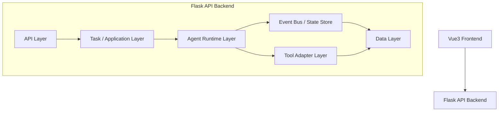
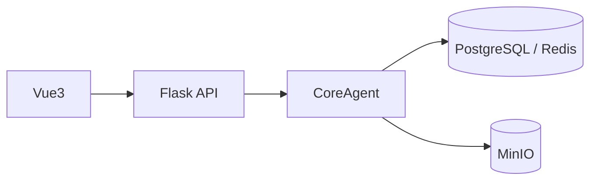
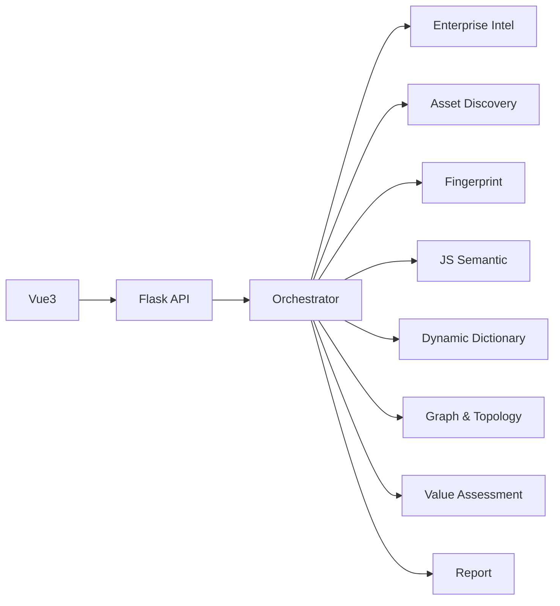
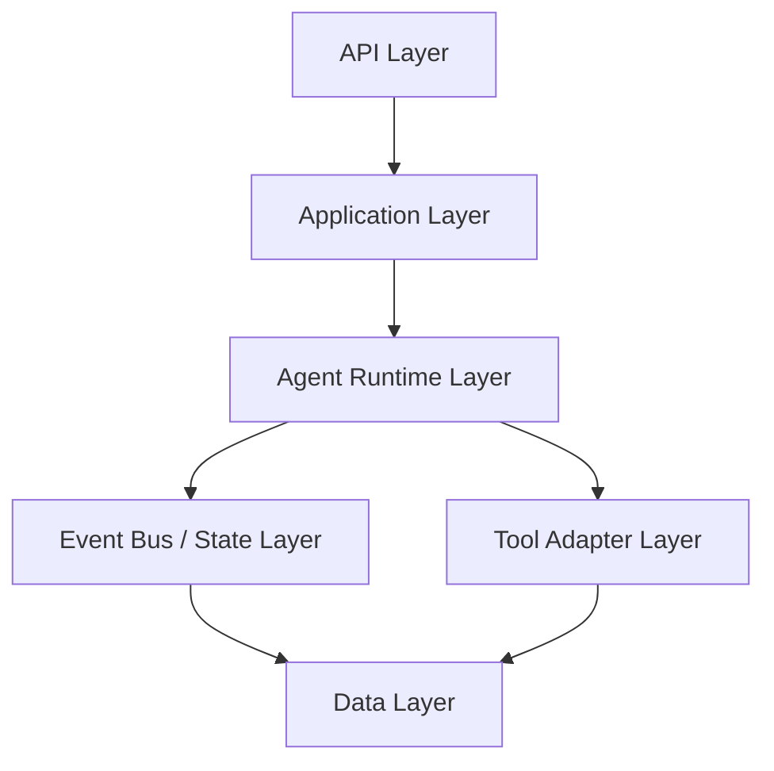

---
title: 第一阶段多 Agent 聚合架构与协同设计
createTime: 2026/03/08 20:35:00
permalink: /heuScan/stage1-implementation/
---
## 一、文档定位与核心决策

### 1.1 文档定位

本文档用于描述 heuScan 第一阶段的落地形态：**多个能力域 Agent 聚合为一个 Flask API 后端，一个 Vue3 前端，并在后端内部形成可扩展的多 Agent Runtime**。

本文档不再将多个 Agent 写成多个独立后端服务，而是明确收敛为：

- **一个 Vue3 前端**：负责任务提交、进度展示、结果查看、图谱与报告展示
- **一个 Flask API 后端**：作为唯一对外 API 入口、任务入口、查询入口、鉴权入口
- **一个后端内部多 Agent Runtime**：由 Orchestrator 统一调度多个 Specialist Agent 与 Review Agent

### 1.2 一期核心决策

第一阶段固定采用以下方案：

1. **模块化单体后端**：所有 Agent 位于同一个后端代码仓中，以模块方式组织，不拆成多个独立服务。
2. **编排优先**：所有 Agent 都由 Orchestrator 统一触发与路由，Agent 之间不直接彼此调用。
3. **统一数据面**：任务、事件、发现、图谱、报告、证据均进入统一的数据模型与存储层。
4. **统一 API 入口**：前端永远只调用 Flask API，不直接接触 Agent。
5. **先单 Agent 再多 Agent**：允许系统从单 Agent MVP 逐步演进到后端内部多 Agent Runtime，而不是一开始就做重型分布式架构。

### 1.3 一期目标

第一阶段要完成的不是“把所有 Agent 都做成复杂自治体”，而是先完成以下四个基础目标：

1. 建立一个可以承载多 Agent 的 **Flask 后端骨架**。
2. 建立一个可以观察任务生命周期的 **统一状态机与事件流**。
3. 建立一个可以让单 Agent 平滑演进为多 Agent 的 **运行时聚合方案**。
4. 建立一个可以承载图谱、报告、证据、日志的 **Vue3 可视化前端**。

### 1.4 设计原则

#### 原则一：多 Agent 是后端内部能力拆分，不是多个后端服务

一期的“多 Agent”强调能力域边界清晰、消息契约统一、运行时可编排，而不是强调物理部署拆分。

#### 原则二：前端只对任务和结果负责，不承担 Agent 协同逻辑

Vue3 前端只负责输入目标、观察进度、查看图谱、查看报告、查看执行记录，不做任何智能编排。

#### 原则三：Flask 后端负责聚合，不让 Agent 各自为政

Flask 后端内部必须有清晰的应用层、运行时层、适配层、数据层，避免 Agent 逐步失控地相互调用。

#### 原则四：先能跑通，再增强异步与扩展

一期先用“模块化单体 + 轻量事件总线 + 后台执行器”跑通闭环；后续若压力增加，再把高负载 Agent 迁移到 Worker，而不改变外部 API。

#### 原则五：所有结论必须可回放、可审计、可追踪

无论单 Agent 还是多 Agent，所有关键行为都必须可追溯到任务、事件、证据、工具调用与状态流转。

---

## 二、总体架构：一个 Flask 后端 + 一个 Vue3 前端 + 后端内部多 Agent Runtime

### 2.1 总体架构形态

第一阶段统一采用如下结构：

```text
Vue3 Frontend
    ↓
Flask API Backend
    ├─ API Layer
    ├─ Task / Application Layer
    ├─ Agent Runtime Layer
    │   ├─ Orchestrator
    │   ├─ Specialist Agents
    │   └─ Review Agent
    ├─ Event Bus / State Store
    ├─ Tool Adapter Layer
    └─ Data Layer (PostgreSQL / Redis / Neo4j / MinIO)
```

### 2.2 Mermaid 总体部署图



### 2.3 这一形态的意义

这种形态解决的是“多个 Agent 怎么聚合成可运维、可开发、可扩展的系统”这个问题：

- **对前端**：只有一个稳定后端，不关心 Agent 个数变化。
- **对后端**：可以在一个工程中管理状态机、任务流、日志、权限、存储。
- **对 Agent**：每个 Agent 只关心自己的能力输入输出，不承担系统编排职责。
- **对后续扩展**：未来若某个 Agent 负载高，只需要把执行器迁移到后台 Worker，不需要重写整体架构。

### 2.4 一期为何不采用多个独立后端服务

一期不建议直接把各 Agent 做成独立服务，主要原因如下：

1. 当前目标是快速建立可运行闭环，微服务会显著提高部署、通信、监控和调试复杂度。
2. 当前 Agent 的边界虽清晰，但还处于快速演化阶段，过早拆服务会导致高频接口返工。
3. 统一状态机、统一任务视图、统一证据链在单体后端内更容易建立。
4. 后续真正需要拆分时，也可以从单体内部模块平滑拆出，无需推倒重来。

---

## 三、从单 Agent 到多 Agent 的演进路线

### 3.1 演进原则

系统不应从“一个混乱的全能 Agent”直接跳到“多个独立自治 Agent”。更稳的路径是：**先做单 Agent MVP，再做单 Agent 内部分层，再做多 Agent Runtime，再做异步化增强**。

### 3.2 四阶段演进架构

#### 阶段 A：单 Agent MVP

系统只有一个 `scan_task` 总入口，由一个 `CoreAgent` 在 Flask 后端内部完成：

- 目标标准化
- 基础资产发现
- 简单指纹识别
- 基础结果输出

目标：先打通 **任务创建 -> 执行 -> 查询结果** 的最小闭环。



#### 阶段 B：单 Agent 内部分层

将 `CoreAgent` 内部拆成 5 类逻辑，但仍保留为一个 Agent：

- 输入处理
- 发现
- 解析
- 研判
- 输出

目标：为后续拆成独立 Agent 提前建立代码边界。

此阶段要做到：

- 流程控制逻辑不再和工具调用混在一起
- 结果聚合逻辑不再和发现逻辑耦合
- 形成内部可迁移的能力模块

#### 阶段 C：多 Agent Runtime

将单 Agent 的内部阶段正式拆成多个 Specialist Agent，例如：

- Enterprise Intel Agent
- Asset Discovery Agent
- Fingerprint Agent
- JS Semantic Agent
- Dynamic Dictionary Agent
- Graph & Topology Agent
- Value Assessment Agent
- Report Agent

由 Orchestrator 按状态机统一调度。

目标：完成“**单体 Flask 后端中的多 Agent 化**”。



#### 阶段 D：增强协同与异步化

在已有 Runtime 基础上再增加：

- Review Agent
- Passive Traffic Audit Agent
- File Intel Agent
- Chain Hint Agent
- 异步 Worker / 队列执行器

目标：增强闭环能力，但对外仍然只有一个 Flask API 后端。

### 3.3 单 Agent 代码向多 Agent 迁移的规则

为了减少返工，迁移时固定遵循以下规则：

1. 单 Agent 中的**流程控制逻辑**，统一迁入 Orchestrator。
2. 单 Agent 中的**业务能力逻辑**，迁入对应 Specialist Agent。
3. 单 Agent 中的**工具调用逻辑**，迁入 Tool Adapter 层。
4. 单 Agent 中的**聚合和输出逻辑**，迁入 Result / Graph / Report Service。
5. 不允许保留“流程控制 + 工具调用 + 业务判断”混杂在同一个类中的写法。

### 3.4 演进后的收益

- 单 Agent 阶段能快速验证可行性。
- 多 Agent 阶段能保持边界清晰和扩展能力。
- 后续引入异步 Worker 时，前端与 API 基本不需要改动。
- 每个 Agent 都能独立测试，但系统仍以一个后端统一运维。

---

## 四、Flask 后端聚合架构设计

### 4.1 分层总览

Flask 后端内部固定划分为 6 层：

1. **API Layer**：Flask 路由与请求入口
2. **Application Layer**：应用服务层
3. **Agent Runtime Layer**：多 Agent 运行层
4. **Event Bus / State Layer**：事件与状态层
5. **Tool Adapter Layer**：工具适配层
6. **Data Layer**：数据存储层



### 4.2 API Layer（Flask 路由层）

#### 职责

- 接收 Vue3 前端请求
- 参数校验、鉴权、限流
- 创建任务、查询任务、查询图谱、查询报告、查询执行记录
- 将 HTTP 请求转换成内部任务命令

#### 对外接口分组

- `/api/tasks`
- `/api/targets`
- `/api/results`
- `/api/graph`
- `/api/reports`
- `/api/system`

#### 设计要求

- API 层不允许直接调用某个具体 Agent。
- API 层只调用 Application Service，由 Application Service 再调用 Orchestrator。
- API 层只面向前端提供稳定协议，不暴露内部 Agent 细节。

### 4.3 Application Layer（应用服务层）

#### 职责

- 把 HTTP 请求转换成内部任务命令
- 管理任务生命周期
- 驱动任务状态推进
- 聚合查询结果供前端使用

#### 核心服务建议

- `TaskService`
- `ExecutionService`
- `ResultService`
- `GraphQueryService`
- `ReportService`

#### 设计要求

- 应用服务层是 API 层和 Runtime 层之间的桥梁。
- 应用服务层不承载 Agent 业务逻辑，只负责协调与聚合。
- 应用服务层必须沉淀统一的任务读写接口和查询接口。

### 4.4 Agent Runtime Layer（多 Agent 运行层）

#### 职责

- 管理 Agent 生命周期
- 加载 AgentContext
- 调度 Agent 执行
- 管理 Agent 注册、能力标签、订阅关系
- 将 Agent 输出转成 ObservationEvent

#### 核心对象建议

- `BaseAgent`
- `OrchestratorAgent`
- `ReviewAgent`
- 各 `SpecialistAgent`
- `AgentRegistry`
- `AgentExecutor`

#### 设计要求

- Runtime 层是后端的核心，不是可有可无的工具层。
- 所有 Agent 都必须在 Runtime 中运行，而不是在服务层自由实例化调用。
- Runtime 必须支持后续将执行器切换为异步 Worker。

### 4.5 Event Bus / State Layer（事件与状态层）

#### 职责

- 接收 Agent 输出事件
- 执行去重、重试、失败隔离
- 推动全局状态机流转
- 支持结果回放与审计

#### 一期建议

- 使用 **PostgreSQL + Redis** 实现轻量事件总线
- PostgreSQL 持久化事件与状态
- Redis 管理短期调度缓存、待执行队列、去重键
- 一期不强依赖 Kafka / RabbitMQ

#### 设计要求

- 事件必须落库，不能只存在内存中。
- 状态机必须由事件驱动，而不是由前端轮询硬拼状态。
- 每个事件都要能够追溯到来源任务、来源 Agent、来源证据。

### 4.6 Tool Adapter Layer（工具适配层）

#### 职责

- 屏蔽扫描器、解析器、外部 API 的具体差异
- 让 Agent 依赖统一工具接口，而不是命令行细节
- 支持未来替换具体工具实现而不改 Agent 核心逻辑

#### 适配器分组建议

- 企业情报适配器
- 网络探测适配器
- HTTP / JS 解析适配器
- 文件提取适配器
- 图谱写入适配器

#### 设计要求

- Agent 只能调用适配器，不直接拼接系统命令或第三方接口协议。
- 所有工具调用必须记录 `ToolCallRecord`，用于审计与问题排查。

### 4.7 Data Layer（数据层）

#### 存储职责

- **PostgreSQL**：任务、事件、发现、评分、审计、报告元数据
- **Redis**：任务队列、短期上下文、去重键、调度缓存
- **Neo4j**：企业关系图、资产图、网络拓扑图
- **MinIO**：HTML、JS、流量、文件、报告等证据对象

#### 设计要求

- 数据层必须围绕统一领域模型设计，而不是围绕单个 Agent 设计。
- 不允许每个 Agent 自己定义一套独立数据结构并直接写库。
- 图谱和报告必须建立在统一证据引用模型上。

---

## 五、多 Agent Runtime 设计与运行规则

### 5.1 Runtime 的总体结构

在统一后端内，多 Agent Runtime 建议固定为以下角色：

- **Orchestrator Agent**：任务分解、调度、状态推进、上下文组装
- **Specialist Agents**：能力域执行单元
- **Review Agent**：复核与安全边界控制
- **Agent Registry**：Agent 注册与查找
- **Agent Executor**：执行 Agent、管理超时、重试和记录
- **Result Aggregator**：汇总阶段性结果供 API 查询

### 5.2 Agent 之间的协作规则

为了防止后端逐渐失控，文档中必须明确以下规则：

1. Agent **不直接通过 HTTP 调用彼此**。
2. Agent **不直接共享内部内存对象**。
3. Agent 统一通过以下对象进行协作：
   - `AgentTask`
   - `AgentContext`
   - `ObservationEvent`
   - `ReviewTicket`
   - 持久化存储中的统一数据对象
4. 所有 Agent 都由 Orchestrator 触发，不允许自由蔓延式调用。
5. Agent 的输入输出必须可记录、可回放、可审计。

### 5.3 Orchestrator 的后端定位

Orchestrator 在这里不是一个抽象概念，而是 Flask 后端内部的核心组件。其职责固定为：

- 创建任务执行计划
- 根据任务状态选择要触发的 Agent
- 为每个 Agent 组装最小上下文
- 处理 `WAIT_EVENT / RETRY / FAILED / REVIEWING`
- 防止事件循环和上下文膨胀
- 聚合阶段结果供 API 层查询

#### 重要约束

- 前端永远不直接调用某个 Agent。
- Flask API 也不直接点名调用某个 Specialist Agent。
- Flask API 只调用 Orchestrator 或 ExecutionService。

### 5.4 Specialist Agent 的后端落位

Specialist Agent 不再被理解为独立服务，而是后端 Runtime 中的能力模块。其边界如下：

| Agent                       | 在聚合后端中的定位       | 主要输入                       | 主要输出              | 负责人 |
| --------------------------- | ------------------------ | ------------------------------ | --------------------- | ------ |
| Enterprise Intel Agent      | 企业情报模块             | 公司名、备案线索、外部情报响应 | 企业实体、关系边      | cr     |
| Asset Discovery Agent       | 基础发现模块             | 域名、IP、路径词典             | 资产发现事件          | cr     |
| Fingerprint Agent           | 指纹识别模块             | HTTP 响应、页面片段、服务特征  | 技术栈标签            | cr     |
| JS Semantic Agent           | JS 解析模块              | JS 文件、HTML、AST 结果        | API / 参数 / 外联线索 | dbh    |
| Dynamic Dictionary Agent    | 扩展词典模块             | 企业别名、指纹、JS 路径        | 扫描词典              | sjw    |
| Graph & Topology Agent      | 图谱聚合模块             | 实体、资产、线索、证据         | 图谱节点、拓扑边      | lyn    |
| Value Assessment Agent      | 价值评估模块             | 图谱关系、资产特征、风险线索   | 优先级标签            | dbh    |
| Report Agent                | 报告输出模块             | 图谱快照、评分结果、证据索引   | 报告与摘要            | sjw    |
| Review Agent                | 复核模块                 | 高风险发现、争议合并、报告草稿 | 复核结论              | lyn    |
| Passive Traffic Audit Agent | 流量审查模块             | HTTP 流量样本                  | 风险线索              | lyn    |
| File Intel Agent            | 文件情报模块             | 可下载文件与提取文本           | 文件线索              | dbh    |
| Chain Hint Agent            | 链路提示模块             | 图谱事实、高价值节点           | 假设链路              | sjw    |
| Orchestrator Agent          | Agent Runtime 的控制核心 | 用户输入                       | 可读性高的结果        | dbh    |

### 5.5 Result Aggregator 的定位

在单体后端下，需要有一个明确的结果聚合器，而不是让前端自己拼结果。其职责是：

- 汇总当前任务的阶段状态
- 聚合最新发现、最新图谱快照、最新报告摘要
- 面向 API 层生成 `TaskSnapshot`
- 为前端提供统一查询视图，而不是暴露底层原始事件表

---

## 六、Agent 列表与聚合后的职责拆分

### 6.1 控制与治理层

#### 1. Orchestrator Agent

- 范式：**PLAN**
- 技术栈：**Python + Flask 后端内部 Runtime + 状态机模块**
- 聚合后职责：
  - 任务拆解
  - Agent 路由
  - 状态推进
  - 上下文裁剪
  - 重试、暂停、恢复、失败隔离
- 在聚合后端中的位置：**Agent Runtime 的控制核心**

#### 2. Review Agent

- 范式：**REFLECT**
- 技术栈：**Python**
- 聚合后职责：
  - 高风险发现复核
  - 图谱冲突合并复核
  - 链路假设复核
  - 报告草稿复核
- 在聚合后端中的位置：**运行时安全阀与质量阀**

### 6.2 情报与发现层

#### 3. Enterprise Intel Agent

- 范式：**PLAN + REFLECT**
- 技术栈：**Python**
- 聚合后职责：企业主体、股东、法人、备案、历史变更等信息整合
- 在聚合后端中的位置：**企业情报入口模块**

#### 4. Asset Discovery Agent

- 范式：**REACT**
- 技术栈：**Go 执行器 + Python 适配器 / Agent 封装**
- 聚合后职责：子域、IP、端口、CDN、基础路径发现
- 在聚合后端中的位置：**网络资产发现模块**

#### 5. Fingerprint Agent

- 范式：**REACT**
- 技术栈：**Python / Go**
- 聚合后职责：前后端技术栈、中间件、组件、CMS 指纹识别
- 在聚合后端中的位置：**资产特征识别模块**

#### 6. JS Semantic Agent

- 范式：**PLAN + REFLECT**
- 技术栈：**Node.js AST 服务 + Python Agent**
- 聚合后职责：API、参数、Token、隐藏接口、外联域名、疑似内网地址提取
- 在聚合后端中的位置：**应用层线索解析模块**

#### 7. Passive Traffic Audit Agent

- 范式：**REACT + REFLECT**
- 技术栈：**Python**
- 聚合后职责：流量线索识别与高风险标注
- 在聚合后端中的位置：**被动风险审查模块**

#### 8. File Intel Agent

- 范式：**PLAN + REACT**
- 技术栈：**Python**
- 聚合后职责：文件下载、文本抽取、敏感信息识别
- 在聚合后端中的位置：**文件情报模块**

### 6.3 决策与输出层

#### 9. Dynamic Dictionary Agent

- 范式：**PLAN + REFLECT**
- 技术栈：**Python**
- 聚合后职责：基于企业名、技术栈、JS 路径生成增量词典
- 在聚合后端中的位置：**扫描策略扩展模块**

#### 10. Graph & Topology Agent

- 范式：**PLAN**
- 技术栈：**Python + Neo4j**
- 聚合后职责：统一图谱和拓扑构建
- 在聚合后端中的位置：**统一事实底座模块**

#### 11. Value Assessment Agent

- 范式：**REFLECT**
- 技术栈：**Python**
- 聚合后职责：资产价值分级、优先级评估、资源倾斜建议
- 在聚合后端中的位置：**价值排序模块**

#### 12. Chain Hint Agent

- 范式：**REFLECT**
- 技术栈：**Python**
- 聚合后职责：生成人工研判级链路提示
- 在聚合后端中的位置：**关系推断辅助模块**

#### 13. Report Agent

- 范式：**PLAN**
- 技术栈：**Python**
- 聚合后职责：生成报告、摘要、证据索引
- 在聚合后端中的位置：**最终产物输出模块**

---

## 七、状态机、事件流与统一接口

### 7.1 全局任务状态机

全局任务状态仍采用：

`CREATED -> SCOPED -> DISCOVERING -> ANALYZING -> EXPANDING -> CORRELATING -> PRIORITIZING -> REPORTING -> REVIEWING -> DONE`

旁路状态：

- `RETRYING`
- `PAUSED`
- `PARTIAL_DONE`
- `FAILED`
- `QUARANTINED`

在聚合后端中，这个状态机由 **Orchestrator + Event Bus / State Layer** 共同维护，而不是由前端推断。

### 7.2 单 Agent 状态机

所有 Agent 统一遵循：

`IDLE -> CLAIMED -> RUNNING -> WAIT_TOOL / WAIT_EVENT -> SELF_CHECK -> EMIT_RESULT -> DONE`

异常分支：

- `RETRY`
- `BLOCKED`
- `FAILED`
- `ESCALATED_TO_REVIEW`

### 7.3 统一事件模型

Agent 协作统一依赖以下领域对象：

- `TargetSeed`
- `TaskCommand`
- `AgentTask`
- `AgentContext`
- `ObservationEvent`
- `EvidenceRef`
- `Finding`
- `GraphNode`
- `GraphEdge`
- `ReviewTicket`
- `TaskSnapshot`
- `AgentExecutionRecord`
- `StateTransition`
- `ToolCallRecord`

### 7.4 ObservationEvent 统一字段

所有事件统一包含：

- `task_id`
- `agent_id`
- `event_type`
- `payload_ref`
- `confidence`
- `priority`
- `scope`
- `lineage`
- `dedupe_key`
- `retry_count`
- `timestamp`

### 7.5 内部 Python 接口

为支持“单 Flask 后端聚合多个 Agent”，内部接口固定建议如下：

```python
class BaseAgent:
    def run(self, task: AgentTask, context: AgentContext) -> list[ObservationEvent]:
        ...

class Orchestrator:
    def plan(self, task: TaskCommand) -> list[AgentTask]:
        ...

    def handle_event(self, event: ObservationEvent) -> StateTransition:
        ...

class AgentRegistry:
    def get_by_capability(self, tag: str) -> BaseAgent:
        ...

class ResultAggregator:
    def build_snapshot(self, task_id: str) -> TaskSnapshot:
        ...
```

### 7.6 Flask API 接口

对外 API 一期建议固定为：

- `POST /api/tasks`
- `GET /api/tasks/{task_id}`
- `GET /api/tasks/{task_id}/timeline`
- `GET /api/tasks/{task_id}/findings`
- `GET /api/tasks/{task_id}/graph`
- `GET /api/tasks/{task_id}/report`
- `GET /api/tasks/{task_id}/agents`
- `POST /api/tasks/{task_id}/retry`
- `POST /api/tasks/{task_id}/pause`
- `POST /api/tasks/{task_id}/resume`

### 7.7 事件驱动关系图

```mermaid
flowchart LR
    A[POST /api/tasks] --> B[TaskService]
    B --> C[Orchestrator]
    C --> D[AgentExecutor]
    D --> E[Specialist Agent]
    E --> F[ObservationEvent]
    F --> G[Event Bus / State Store]
    G --> C
    G --> H[Result Aggregator]
    H --> I[GET /api/tasks/{task_id}]
```

---

## 八、Vue3 前端定位与交互设计

### 8.1 前端定位

Vue3 前端的职责被明确收敛为：**展示与操作层，而非智能调度层**。

前端不承担：

- Agent 编排
- 状态推理
- 事件聚合
- 工具调用

前端承担：

- 目标与任务配置输入
- 任务状态展示
- 发现结果展示
- 图谱与拓扑展示
- 报告与证据查看
- Review 结果的人工确认扩展入口

### 8.2 前端核心页面

一期建议至少包含以下页面：

1. **任务创建页**：输入公司名、域名、IP、目标配置
2. **任务详情页**：查看状态机阶段、当前执行 Agent、错误与重试信息
3. **资产 / 发现列表页**：查看资产、线索、评分与证据
4. **图谱与拓扑页**：查看企业图谱、资产图、网络拓扑
5. **报告页**：查看报告正文、摘要与导出结果
6. **系统运行状态页**：查看队列积压、Agent 执行状态、系统健康信息

### 8.3 前端核心能力

- 提交目标和任务配置
- 轮询或订阅任务状态更新
- 查看任务时间线
- 查看各 Agent 的阶段结果与执行记录
- 查看图谱、证据、报告
- 为未来人工复核预留操作入口

### 8.4 前端建议技术栈

- **Vue3**：基础框架
- **Pinia**：任务状态、结果状态、图谱状态管理
- **Axios**：统一请求 Flask API
- **ECharts / G6 / Cytoscape**：图谱或拓扑展示，文档先保持可替换

### 8.5 前后端交互原则

- 前端的所有数据都来自 Flask API，而不是自行拼装。
- 前端获取的是任务快照和聚合结果，不直接读取底层事件表。
- 前端展示层与 Agent 数量解耦，未来新增 Agent 不应强制修改前端协议。

---

## 九、后端工程目录与代码组织建议

### 9.1 单仓单后端目录建议

```text
backend/
  app/
    api/
    services/
    orchestrator/
    agents/
    adapters/
    schemas/
    models/
    repositories/
    runtime/
    utils/
```

### 9.2 各目录职责

- `api/`：Flask 路由与请求/响应协议
- `services/`：任务服务、结果服务、图谱查询服务、报告服务
- `orchestrator/`：状态机、调度策略、任务规划
- `agents/`：各 Agent 模块
- `adapters/`：外部工具、API 和解析器适配器
- `schemas/`：Pydantic 或 dataclass Schema 定义
- `models/`：数据库模型
- `repositories/`：数据读写访问层
- `runtime/`：事件总线、执行器、上下文装配器、注册表
- `utils/`：通用工具函数

### 9.3 代码组织约束

- `api/` 不得直接依赖 `agents/`。
- `agents/` 不得直接访问 Flask request 对象。
- `agents/` 不得直接访问第三方工具命令，而应通过 `adapters/`。
- `orchestrator/` 负责流程推进，`services/` 负责应用级聚合查询。
- 数据写入尽量通过统一 Repository，不让 Agent 直接拼 SQL 或图谱语句。

---

## 十、队列、异步化与后续演进策略

### 10.1 一期默认执行模式

一期默认采用：

- Flask 同进程 API
- 后台线程或轻量任务执行器
- Redis 做短期调度缓存与任务分发
- PostgreSQL 做持久化事件与状态存储

这种方式适合先验证单体聚合架构，不必一开始就引入重型队列系统。

### 10.2 一期增强 / 二期演进模式

当系统出现更高并发或更重的扫描任务时，再演进为：

- Flask 仍是唯一对外 API
- 重任务交由 Celery / RQ Worker 执行
- API 层、任务接口、前端协议不变
- Agent 不感知自己是在同进程执行还是在 Worker 中执行

### 10.3 可演进但不提前实现的能力

以下能力作为后续扩展保留，不在一期强制实现：

- 多 Worker 分布式执行
- 多租户权限隔离
- 实时 WebSocket 推送
- 高可用队列与监控
- Agent 动态热插拔

### 10.4 演进边界

为了保证平滑升级，后续演进必须遵守：

1. 前端接口不因内部执行方式变化而变化。
2. Agent 接口不因同步 / 异步切换而变化。
3. Orchestrator 的状态机契约不因 Worker 引入而变化。
4. 事件模型与证据模型保持稳定版本控制。

---

## 十一、测试计划与验收标准

### 11.1 单 Agent -> 多 Agent 演进测试

1. 单 Agent 模式可完成基础任务闭环。
2. 拆出第一个 Specialist Agent 后，结果与单 Agent 基线一致。
3. 多 Agent 模式下任务状态机可稳定推进。
4. 将某一能力从单 Agent 迁移到 Specialist Agent 后，前端查询接口保持不变。

### 11.2 Flask 聚合后端测试

1. 创建任务、查询状态、查询结果、查询图谱、查询报告接口可正常工作。
2. API 层不直接依赖具体 Agent 实现。
3. Application Layer 能正确调用 Orchestrator。
4. Orchestrator 能根据事件正确路由到对应 Agent。

### 11.3 Runtime 运行测试

1. 事件去重有效，防止循环触发。
2. Agent 失败后能重试、暂停或降级。
3. Review 节点能阻断错误结论扩散。
4. Result Aggregator 能稳定输出任务快照。

### 11.4 前后端联调测试

1. Vue3 能提交任务并展示状态机阶段。
2. Vue3 能展示任务时间线、发现列表、图谱与报告。
3. 长任务可通过轮询或订阅获取更新。
4. 新增 Agent 后，前端主要页面无需大改。

### 11.5 演进兼容测试

1. 将某个 Agent 从同步执行迁移到异步 Worker 后，API 不变。
2. 替换某个底层工具适配器后，Agent 输出协议不变。
3. 新增 Agent 后，不需要重写现有前端接口协议。

### 11.6 一期验收标准

一期完成时，至少应达到以下标准：

1. 系统对外体现为 **一个 Flask API 后端 + 一个 Vue3 前端**。
2. 多个 Agent 已经聚合到同一个后端 Runtime 中，而不是分散为多个服务。
3. Orchestrator 已成为系统统一的任务编排入口。
4. 任务、事件、发现、图谱、报告已进入统一数据面。
5. 前端可以查看任务状态、发现结果、图谱与报告。
6. 系统具备从单 Agent 演进到多 Agent 的清晰迁移路径。
7. 后续若迁移到 Worker，不需要重写前端接口和核心 Agent 契约。

---

## 十二、默认假设

1. 一期重点是**更新和固化文档3的聚合架构方案**，不是立即实现代码。
2. 一期选择 **模块化单体 Flask 后端 + Vue3 前端 + 编排优先**，不采用微服务优先方案。
3. 多 Agent 的“聚合”指的是 **统一到一个后端运行时中**，而不是合并成一个超大 Agent。
4. 后续若性能或并发压力上升，再把高负载 Agent 平滑迁移到 Worker；但对外仍保持一个 Flask API 后端。
5. 本文档仍然只用于授权场景下的信息收集、分析、图谱构建与报告输出，不涉及自动化攻击执行设计。
