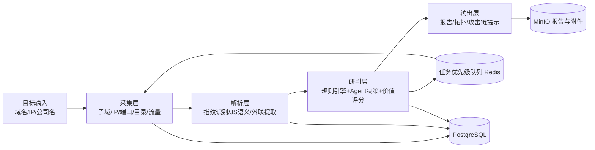
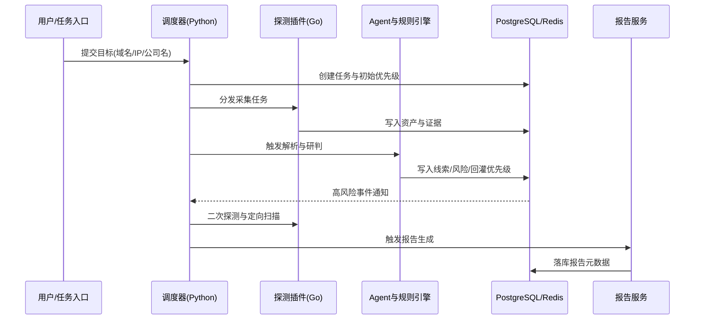

## 一、设计原则

1. **目标导向**：围绕“信息收集效率、完整性、准确性”三项核心指标设计能力。
2. **闭环优先**：采集、解析、研判、输出形成反馈闭环，高风险线索可反向驱动下一轮探测。
3. **可演进架构**：第一版采用模块化单体，优先交付 MVP，后续可按边界平滑拆分服务。
4. **插件化扩展**：扫描器、解析器、规则引擎均采用插件模型，降低新增能力成本。
5. **安全合规**：默认用于授权测试场景，内置频率控制、审计日志、异常熔断与循环保护。

## 二、技术栈选型

### 2.1 总体选型（混合栈）

| 层级 | 技术选型 | 主要职责 | 选型理由 |
| --- | --- | --- | --- |
| 扫描/探测引擎层 | Go | 高并发资产探测、端口/路径扫描、资产指纹识别 | 并发模型成熟、资源占用低、长时任务稳定性高 |
| 编排与 Agent 层 | Python | 任务调度、规则引擎、Agent 决策、二次审计 | 数据处理生态完善，迭代速度快，便于接入 LLM/规则体系 |
| 管理与展示层 | Vue 3 + TypeScript | 任务管理、拓扑展示、报告可视化 | 与现有文档工程一致，前端开发与维护成本可控 |
| 数据与存储层 | PostgreSQL + Redis + MinIO | 结构化数据、缓存队列、文件与报告存储 | 职责清晰、组合成熟、便于后续扩展 |

### 2.2 存储职责划分

- **PostgreSQL**：任务、资产、线索、风险标签、报告元数据等核心结构化数据。
- **Redis**：任务优先级队列、热点缓存、限速计数器、短期会话上下文。
- **MinIO**：JS 文件归档、流量样本、文档情报、报告导出产物。
- **图谱能力演进**：V1 先用 PostgreSQL 关系表 + 物化视图；V2 再按规模评估接入 Neo4j。

## 三、总体架构

### 3.1 架构风格

- 采用**模块化单体**：统一部署、统一配置、统一日志链路。
- 采用四层解耦：**采集层 -> 解析层 -> 研判层 -> 输出层**。
- 采用插件机制：子域名、IP、端口、目录、JS、被动流量插件按统一契约接入。

### 3.2 架构示意

### 3.3 关键边界

- **外部 API 分组**：资产发现、任务控制、风险线索、报告导出。
- **内部统一插件 I/O 契约**：输入目标与上下文；输出证据、置信度、风险标签、建议动作。
- **领域事件类型**：
  - `AssetDiscovered`
  - `ClueDetected`
  - `RiskEscalated`
  - `ReportGenerated`

## 四、核心模块设计

### 4.1 采集层（Discovery）

- 资产发现：子域名枚举、IP 解析、端口扫描、CDN 识别。
- 基础探测：路径扫描、服务识别、响应指纹抓取。
- 插件示例：`subdomain_collector`、`port_scanner`、`path_probe`、`traffic_listener`。

### 4.2 解析层（Parser）

- JS 语义深度解析：提取 API 路径、参数、token/key、调试与测试接口线索。
- 指纹识别：基于响应头、页面特征、JS 特征识别中间件/CMS/框架。
- 文件情报：可下载文档归档并抽取敏感关键词线索。

### 4.3 研判层（Decision）

- 动态扫描字典：基于技术栈、公司信息、已发现路径生成增量字典。
- 风险线索标记：对 `id`/`file`/`url`/`cmd` 等参数模式进行候选风险分类。
- Agent 二次审计：对高风险目标触发复核，并回灌任务优先级。
- 攻击链提示：输出“潜在关联路径”，仅作为人工研判建议，不自动执行攻击行为。

### 4.4 输出层（Output）

- 关系图谱：公司、人员、资产、服务节点关联可视化。
- 网络拓扑：域名-IP-端口-路径-组件链路图。
- 报告生成：信息收集报告、风险摘要、证据索引、后续建议。

### 4.5 痛点到模块映射

| 痛点 | 对应模块 | 解决方式 |
| --- | --- | --- |
| 工具分散、流程割裂 | 任务编排 + 统一数据模型 | 全流程统一入口与统一资产视图 |
| 固定字典扫描冗余 | 动态字典引擎 | 基于目标特征增量扩展路径 |
| IP/端口/子域信息孤立 | 资产关联与图谱模块 | 统一 ID 建模并进行关系关联 |
| JS/页面人工审查成本高 | JS 深度解析 + 文件情报 | 自动提取接口、敏感键值与外联线索 |
| 高价值目标难排序 | 风险评分与价值分级 | 按置信度、影响面、利用链相关性排序 |
| 攻击链路需人工推演 | 关联规则 + Agent 提示 | 提供可解释的潜在链路建议 |

## 五、关键数据流

## 六、开发路线与里程碑（12-24 周）

| 阶段 | 时间 | 交付物 | 验收标准 | 主要风险点 | 退出条件 |
| --- | --- | --- | --- | --- | --- |
| 阶段 1：MVP 基座 | 周 1-4 | 资产发现、基础扫描、任务编排、基础报告 | 可完成从目标输入到报告导出的最小闭环 | 资产模型定义不清导致返工 | 可稳定执行 50+ 目标批量任务且报告可用 |
| 阶段 2：能力增强 | 周 5-10 | 动态字典、JS 深度解析、被动流量审查、价值打分 v1 | 动态字典命中率与人工基线相比有显著提升 | 误报率偏高、解析性能不足 | 关键能力可配置开关，误报率可控 |
| 阶段 3：闭环联动 | 周 11-16 | 攻击链提示、拓扑图谱、二次审计策略 | 高风险线索可自动回灌并触发优先扫描 | 事件风暴导致任务堆积 | 队列积压与超时率满足阈值，链路可追踪 |
| 阶段 4：稳定化工程化 | 周 17-24 | 压测、插件规范、可观测性、发布与回滚方案 | 支撑长期运行，具备版本化发布能力 | 长稳运行内存与资源泄漏 | 完成压测目标并形成运维SOP |

## 七、风险与治理

### 7.1 技术风险

- **循环扫描风险**：设置任务深度上限、去重指纹、死循环检测。
- **WAF/封禁风险**：引入速率控制、重试退避、目标保护策略。
- **误报漏报风险**：规则版本化、人工复核通道、样本回放评估。

### 7.2 安全与合规

- 默认仅用于**授权测试**与企业内网安全评估场景。
- 所有任务写入审计日志，保留触发来源、规则版本、证据链。
- 敏感数据分级存储，导出报告支持脱敏模板。

### 7.3 质量保障与验收清单

- 文档结构完整：技术栈、架构、模块、数据流、路线、治理齐全。
- 痛点映射完整：每个痛点均映射到至少一个落地模块。
- 构建校验通过：`npm run docs:build` 无 Markdown 语法错误。
- 图示可读：架构图与数据流图可直接用于评审沟通。
