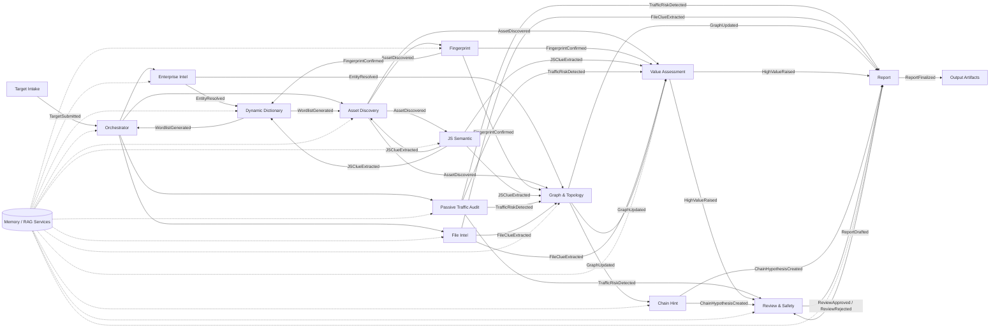
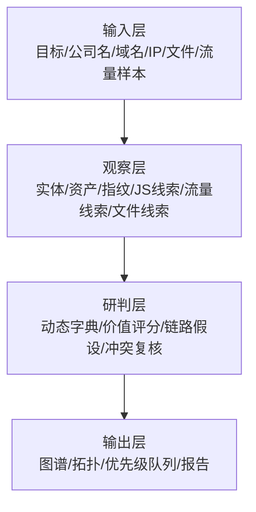

---
title: 第一阶段多 Agent 功能拆解与协同架构设计
createTime: 2026/03/08 20:35:00
permalink: /heuScan/stage1-implementation/
---
## 一、一期目标与设计原则

### 1.1 文档定位

本文档是 heuScan 第一阶段的多 Agent 实施设计文档，仅以《项目介绍与解决痛点》中的需求为输入来源，目标是将原始功能描述拆解为可独立开发、可独立验收、可最终组合的多 Agent 体系。

本文档不再沿用“开发日志”式写法，而是直接给出一期可执行的架构设计，包括：

- 功能到 Agent 的拆分边界
- 多 Agent 协同方式
- 节点—边的信息流与数据流
- 全局状态机与单 Agent 状态机
- 每个 Agent 的范式、框架、消息、记忆、RAG、上下文与 Prompt 设计
- 先独立开发、后统一集成的工程化策略

### 1.2 一期目标

第一阶段不追求把所有能力一次性做满，而是先完成一个可扩展的多 Agent 基础骨架，使系统具备以下能力：

1. 能围绕目标公司、域名、IP、网站形成统一任务上下文。
2. 能将企业情报、资产发现、指纹识别、JS 解析、被动流量审查、文件情报等能力拆成独立 Agent。
3. 能通过统一消息契约将各 Agent 输出汇聚到图谱与拓扑模型中。
4. 能通过 Reviewer 形成关键决策的 Duo 协同闭环，降低误报和错误扩散。
5. 能支持后续继续新增 Agent，而不需要推翻一期架构。

### 1.3 设计原则

#### 原则一：按能力域拆分，而不是按脚本或工具拆分

每个 Agent 对应一个清晰的业务能力域，避免把多个高度耦合的判断逻辑塞进单一 Agent，也避免仅以某个具体工具作为边界。

#### 原则二：先独立开发，再组合编排

每个 Agent 都必须可以在 mock 输入和 mock 事件总线上独立运行、独立测试、独立验收，最终再通过 Orchestrator 统一编排。

#### 原则三：关键链路采用 Duo 协同

系统整体是多 Agent 架构，但在高风险、高价值、高不确定性的节点上，使用“执行 Agent + 复核 Agent”的 Duo 协同方式，例如：

- 高价值资产判定
- 攻击链路提示
- 高风险流量线索
- 图谱实体归一冲突

#### 原则四：证据优先、结论可回溯

所有 Agent 输出都必须尽量引用证据对象、证据 ID、来源链路与置信度，不允许只输出主观判断而不附带依据。

#### 原则五：扩展优先于一次性完美

一期必须优先建立统一契约、统一状态、统一消息、统一存储抽象，让新增 Agent 只需遵守约定即可挂入系统。

#### 原则六：仅用于授权场景下的信息收集与研判

本文档中的链路提示与价值判断仅用于授权测试场景下的信息收集、风险线索归纳与人工分析，不包含自动化攻击执行设计。

---

## 二、功能到 Agent 的完整拆分

### 2.1 总体协同模式

一期整体采用：

**Supervisor / Orchestrator + Specialist Agents + Reviewer Agent**

其中：

- **Orchestrator Agent**：负责任务拆解、状态推进、事件路由、上下文裁剪、失败恢复。
- **Specialist Agents**：围绕企业情报、资产发现、技术识别、语义解析、图谱构建、报告生成等能力独立工作。
- **Review & Safety Agent**：对关键结论进行复核，形成 Duo 协同闭环。

### 2.2 Agent 清单总览

| 层级       | Agent                       | 主要职责                                 | 协同定位     |
| ---------- | --------------------------- | ---------------------------------------- | ------------ |
| 控制与治理 | Orchestrator Agent          | 统一任务编排、状态推进、上下文组装       | 总控         |
| 控制与治理 | Review & Safety Agent       | 复核关键结论、抑制误报、循环防护         | Duo 复核     |
| 情报与发现 | Enterprise Intel Agent      | 公司、法人、股东、备案、历史变更情报整合 | 企业实体源   |
| 情报与发现 | Asset Discovery Agent       | 子域、IP、端口、CDN、HTTP 资产发现       | 基础资产源   |
| 情报与发现 | Fingerprint Agent           | 前后端技术栈、中间件、CMS、组件识别      | 特征源       |
| 情报与发现 | JS Semantic Agent           | JS 深度语义解析与接口线索抽取            | 应用线索源   |
| 情报与发现 | Passive Traffic Audit Agent | 流量中的风险线索识别与标注               | 被动审查源   |
| 情报与发现 | File Intel Agent            | 文件下载、文本抽取、敏感信息提取         | 文档情报源   |
| 决策与输出 | Dynamic Dictionary Agent    | 增量扫描词典生成与控制                   | 扫描扩展器   |
| 决策与输出 | Graph & Topology Agent      | 企业关系图、资产图、网络拓扑构建         | 统一知识图谱 |
| 决策与输出 | Value Assessment Agent      | 资产价值与优先级评估                     | 价值排序器   |
| 决策与输出 | Chain Hint Agent            | 潜在攻击链路提示生成                     | 人工研判辅助 |
| 决策与输出 | Report Agent                | 信息收集报告、证据索引、摘要输出         | 最终输出     |

### 2.3 功能到 Agent 的映射关系

| 原始功能               | 主 Agent                                  | 协作 Agent                                                       |
| ---------------------- | ----------------------------------------- | ---------------------------------------------------------------- |
| 企业信息图谱构建       | Enterprise Intel Agent                    | Graph & Topology Agent、Review & Safety Agent                    |
| 动态扫描字典生成       | Dynamic Dictionary Agent                  | Fingerprint Agent、JS Semantic Agent、Enterprise Intel Agent     |
| JS 语义深度解析        | JS Semantic Agent                         | Asset Discovery Agent、Graph & Topology Agent                    |
| 被动流量审查           | Passive Traffic Audit Agent               | Review & Safety Agent、Value Assessment Agent                    |
| 网络拓扑结构生成       | Graph & Topology Agent                    | Asset Discovery Agent、Enterprise Intel Agent、Fingerprint Agent |
| 目标价值评估与攻击建议 | Value Assessment Agent、Chain Hint Agent  | Review & Safety Agent、Graph & Topology Agent                    |
| 信息收集报告自动生成   | Report Agent                              | Graph & Topology Agent、Value Assessment Agent                   |
| 传统资产发现能力       | Asset Discovery Agent                     | Fingerprint Agent、Dynamic Dictionary Agent                      |
| 资产指纹识别           | Fingerprint Agent                         | Dynamic Dictionary Agent、Value Assessment Agent                 |
| 文件情报收集           | File Intel Agent                          | Graph & Topology Agent、Value Assessment Agent                   |
| 漏洞线索标记           | Passive Traffic Audit Agent               | Review & Safety Agent、Report Agent                              |
| Agent 决策调度         | Orchestrator Agent                        | Review & Safety Agent                                            |
| 错误处理               | Orchestrator Agent、Review & Safety Agent | 全部 Agent                                                       |

### 2.4 一期建议优先实现顺序

为兼顾交付速度与后续扩展性，一期建议按以下顺序实现：

**第一批骨干 Agent**

1. Orchestrator Agent
2. Enterprise Intel Agent
3. Asset Discovery Agent
4. Fingerprint Agent
5. JS Semantic Agent
6. Dynamic Dictionary Agent
7. Graph & Topology Agent
8. Value Assessment Agent
9. Report Agent

**第二批增强 Agent**

10. Passive Traffic Audit Agent
11. File Intel Agent
12. Chain Hint Agent
13. Review & Safety Agent（从一期开始即需要最小版本，后续再增强）

说明：Review & Safety Agent 在架构上必须存在，但早期可先做成规则驱动 + 轻量 LLM 复核模式，后续再扩充成完整反思型 Agent。

---

## 三、多 Agent 总体协同架构

### 3.1 分层架构

系统整体分为四层：

1. **输入与任务层**：接收目标、公司名、域名、IP、文件、流量样本等输入。
2. **观察与发现层**：由企业情报、资产发现、指纹识别、JS 解析、流量审查、文件情报等 Agent 产出观察结果。
3. **研判与关联层**：由动态字典、图谱构建、价值评估、链路提示、复核 Agent 进行聚合判断。
4. **输出层**：产出报告、图谱、拓扑与优先级清单。

### 3.2 节点—边协同图

### 3.3 分层数据流图

### 3.4 关键协同闭环

#### 闭环一：资产发现闭环

目标输入后，Asset Discovery Agent 先发现子域、IP、端口、URL 入口，Fingerprint Agent 与 JS Semantic Agent 再持续补充上下文，Dynamic Dictionary Agent 反向生成新增词典并驱动下一轮发现。

#### 闭环二：价值提升闭环

高价值资产或高风险线索被识别后，Value Assessment Agent 会提升优先级，Review & Safety Agent 进行二次复核，Orchestrator 再决定是否分配更多资源继续探测。

#### 闭环三：图谱聚合闭环

企业情报、网络资产、文件线索、流量线索都会持续汇入 Graph & Topology Agent，由其统一做实体归一、关系建边、证据挂接，然后为 Report 与 Chain Hint 提供统一事实底座。

---

## 四、节点—边信息流 / 数据流设计

### 4.1 统一消息契约设计目标

为了支持“先独立开发、后统一编排”，所有 Agent 间不直接共享内部对象，而通过统一事件消息传递。消息应满足：

- 可追踪：能定位来源 Agent、来源任务、来源证据
- 可去重：能防止相同结果反复触发循环
- 可复核：能把争议结论送入复核流程
- 可扩展：新增 Agent 只需订阅事件和声明输出事件

### 4.2 公共接口 / 类型定义

一期统一采用以下领域类型：

- `TargetSeed`：用户输入的目标种子，如公司名、域名、IP、URL、文件、流量样本
- `AgentTask`：派发给某个 Agent 的执行任务
- `AgentContext`：任务上下文、窗口化证据和约束信息
- `ObservationEvent`：各 Agent 输出的标准观察事件
- `EvidenceRef`：证据对象引用，如 HTML、JS、HTTP 包、文件、截图、解析结果
- `Finding`：结构化发现项，包含分类、置信度、证据引用
- `GraphNode`：图谱节点
- `GraphEdge`：图谱边
- `ReviewTicket`：需要复核的事项
- `TaskStateSnapshot`：任务状态快照

### 4.3 消息 Envelope 字段

所有事件消息统一包含以下字段：

| 字段            | 说明                       |
| --------------- | -------------------------- |
| `task_id`     | 所属任务 ID                |
| `agent_id`    | 发送消息的 Agent ID        |
| `event_type`  | 事件类型                   |
| `payload_ref` | 事件载荷引用或对象存储位置 |
| `confidence`  | 置信度                     |
| `priority`    | 优先级                     |
| `scope`       | 当前发现所属目标范围       |
| `lineage`     | 上游事件链路，记录由谁触发 |
| `dedupe_key`  | 去重键                     |
| `retry_count` | 当前消息重试次数           |
| `timestamp`   | 事件时间戳                 |

### 4.4 固定事件类型

一期统一定义以下事件类型：

- `TargetSubmitted`
- `EntityResolved`
- `AssetDiscovered`
- `FingerprintConfirmed`
- `JSClueExtracted`
- `TrafficRiskDetected`
- `FileClueExtracted`
- `WordlistGenerated`
- `GraphMerged`
- `ValueRaised`
- `ChainHypothesisCreated`
- `ReviewApproved`
- `ReviewRejected`
- `ReportReady`

### 4.5 关键节点与边说明

| 边                                                                  | 含义                           | 作用                   |
| ------------------------------------------------------------------- | ------------------------------ | ---------------------- |
| `TargetSubmitted -> Orchestrator`                                 | 任务进入总控                   | 创建状态机与子任务     |
| `EntityResolved -> Graph & Dynamic Dictionary`                    | 企业实体进入图谱与词典引擎     | 支撑图谱和命名字典扩展 |
| `AssetDiscovered -> Fingerprint / JS / Value`                     | 新资产触发多路观察             | 补足特征、接口、优先级 |
| `FingerprintConfirmed -> Dynamic Dictionary / Value`              | 技术栈驱动路径推断与价值判断   | 增强扫描方向           |
| `JSClueExtracted -> Asset Discovery / Graph / Dynamic Dictionary` | JS 线索反哺发现与图谱          | 形成新增目标入口       |
| `TrafficRiskDetected -> Review / Value / Report`                  | 流量风险进入复核、优先级和报告 | 保证风险线索被闭环处理 |
| `FileClueExtracted -> Graph / Value`                              | 文件情报进入图谱和价值层       | 丰富上下文             |
| `GraphUpdated -> Chain Hint / Report`                             | 图谱变更驱动链路提示和报告刷新 | 统一输出事实底座       |
| `HighValueRaised -> Review / Report`                              | 高价值目标进入复核和报告高亮   | 防止高价值误判         |
| `ReportDrafted -> Review -> ReportFinalized`                      | 报告先复核再定稿               | 提高最终质量           |

---

## 五、全局状态机与单 Agent 状态机

### 5.1 全局任务状态机

一期任务主状态机定义为：

`CREATED -> SCOPED -> DISCOVERING -> ANALYZING -> EXPANDING -> CORRELATING -> PRIORITIZING -> REPORTING -> REVIEWING -> DONE`

旁路状态包括：

- `RETRYING`
- `PAUSED`
- `PARTIAL_DONE`
- `FAILED`
- `QUARANTINED`

### 5.2 全局状态说明

| 状态             | 含义                                 | 主要参与 Agent                                 |
| ---------------- | ------------------------------------ | ---------------------------------------------- |
| `CREATED`      | 任务刚创建，尚未分配执行上下文       | Orchestrator                                   |
| `SCOPED`       | 明确目标类型、范围、预算、初始输入   | Orchestrator                                   |
| `DISCOVERING`  | 执行企业情报与基础资产发现           | Enterprise Intel、Asset Discovery、Fingerprint |
| `ANALYZING`    | 执行 JS、流量、文件等深入分析        | JS Semantic、Passive Traffic Audit、File Intel |
| `EXPANDING`    | 通过动态字典与新发现继续增量探索     | Dynamic Dictionary、Asset Discovery            |
| `CORRELATING`  | 图谱融合、实体归一、证据挂接         | Graph & Topology                               |
| `PRIORITIZING` | 价值评估、风险排序、链路提示生成     | Value Assessment、Chain Hint                   |
| `REPORTING`    | 生成阶段性报告与最终报告草稿         | Report                                         |
| `REVIEWING`    | 对高价值、高风险、高不确定结论做复核 | Review & Safety                                |
| `DONE`         | 所有必要结果已完成输出               | Orchestrator                                   |

### 5.3 旁路状态触发规则

- **`RETRYING`**：外部 API 超时、工具失败、网络暂时不可达时进入。
- **`PAUSED`**：达到预算阈值、遇到人工确认门槛或上游依赖未就绪时进入。
- **`PARTIAL_DONE`**：部分 Agent 已完成、部分能力暂不可用，但任务可输出阶段性结果时进入。
- **`FAILED`**：核心链路失败且不可恢复。
- **`QUARANTINED`**：检测到循环膨胀、证据污染、目标超范围或安全风险时进入隔离态。

### 5.4 单 Agent 状态机

所有 Agent 统一遵循：

`IDLE -> CLAIMED -> RUNNING -> WAIT_TOOL / WAIT_EVENT -> SELF_CHECK -> EMIT_RESULT -> DONE`

异常分支：

- `RETRY`
- `BLOCKED`
- `FAILED`
- `ESCALATED_TO_REVIEW`

### 5.5 单 Agent 状态解释

| 状态                    | 含义                                         |
| ----------------------- | -------------------------------------------- |
| `IDLE`                | 未分配任务                                   |
| `CLAIMED`             | 已领取任务并装载上下文                       |
| `RUNNING`             | 正在执行内部流程                             |
| `WAIT_TOOL`           | 等待外部工具、API、解析服务返回              |
| `WAIT_EVENT`          | 等待上游 Agent 事件                          |
| `SELF_CHECK`          | 做结果去重、完整性校验、置信度整理           |
| `EMIT_RESULT`         | 输出 ObservationEvent / Finding / Graph 数据 |
| `DONE`                | 当前任务完成                                 |
| `RETRY`               | 重试当前任务                                 |
| `BLOCKED`             | 当前依赖缺失，无法推进                       |
| `FAILED`              | 当前任务失败                                 |
| `ESCALATED_TO_REVIEW` | 结果存在争议，升级交由复核 Agent             |

---

## 六、各 Agent 详细设计

本节统一从以下维度定义每个 Agent：

- 职责
- 输入
- 输出
- 范式
- 推荐框架
- 内部消息处理方式
- 记忆设计
- RAG 配置
- 上下文设计
- Prompt 骨架
- 失败策略
- 扩展点

### 6.1 Orchestrator Agent

| 项          | 设计                                                                                                                         |
| ----------- | ---------------------------------------------------------------------------------------------------------------------------- |
| 职责        | 任务建模、状态推进、事件路由、上下文裁剪、预算与限流、失败恢复、循环保护                                                     |
| 输入        | `TargetSeed`、任务配置、预算、Agent 注册表、上游事件                                                                       |
| 输出        | `AgentTask`、状态变更、调度事件、终止/暂停指令                                                                             |
| 范式        | **PLAN**                                                                                                               |
| 推荐框架    | **Python + LangGraph + FastAPI**                                                                                       |
| 消息处理    | 基于事件总线订阅 `TargetSubmitted`、`GraphMerged`、`ValueRaised`、`ReviewApproved/Rejected`，维护任务 DAG 与执行队列 |
| 记忆        | Redis 保存任务窗口与调度队列；PostgreSQL 保存任务状态、审计日志与调度决策                                                    |
| RAG         | 不做通用知识检索，主要检索“调度规则库、限流规则、Agent 能力注册表”                                                         |
| 上下文      | 只向下游下发目标范围、必要证据摘要、预算、已执行路径和禁止动作                                                               |
| Prompt 骨架 | 以“任务规划者”身份工作；输出下一步应触发哪些 Agent、每个 Agent 的上下文窗口、何时停止与何时复核                            |
| 失败策略    | 对临时异常重试；对循环行为触发隔离；对预算耗尽转为 `PAUSED` 或 `PARTIAL_DONE`                                            |
| 扩展点      | 可新增策略路由器、优先级调度器、成本控制器                                                                                   |

### 6.2 Review & Safety Agent

| 项          | 设计                                                           |
| ----------- | -------------------------------------------------------------- |
| 职责        | 关键结论复核、冲突消解、误报抑制、死循环检测、范围与合规护栏   |
| 输入        | `ReviewTicket`、高风险 `Finding`、冲突图谱边、报告草稿     |
| 输出        | `ReviewApproved`、`ReviewRejected`、修正建议、风险备注     |
| 范式        | **REFLECT**                                              |
| 推荐框架    | **Python + LangGraph**                                   |
| 消息处理    | 仅消费升级事件，不主动发起探测；对结论进行证据回看与一致性检查 |
| 记忆        | PostgreSQL 保存复核记录与误报样本；Redis 保存短期复核上下文    |
| RAG         | 风险判定规则库、误报案例库、合规边界规则库                     |
| 上下文      | 注入原始结论、证据引用、上游推理摘要和任务范围                 |
| Prompt 骨架 | 以“复核员”身份判断：证据是否充分、是否越界、是否需驳回或降级 |
| 失败策略    | 无法确定时输出“需人工确认”；不允许直接放大风险               |
| 扩展点      | 可接入规则引擎、人工审核面板、回放分析器                       |

### 6.3 Enterprise Intel Agent

| 项          | 设计                                                                       |
| ----------- | -------------------------------------------------------------------------- |
| 职责        | 企业主体、备案、法人、股东、股权结构、历史变更等情报整合，抽取实体与关系边 |
| 输入        | 公司名、域名、备案关键词、外部情报源响应                                   |
| 输出        | `EntityResolved`、企业节点、人员节点、关系边、别名集合                   |
| 范式        | **PLAN + REFLECT**                                                   |
| 推荐框架    | **Python**                                                           |
| 消息处理    | 先规划查询路径，再对多来源结果做归一、冲突处理、别名合并                   |
| 记忆        | PostgreSQL 保存实体归一结果；Neo4j 保存关系边                              |
| RAG         | 企业别名/简称规则库、组织实体归一规则库                                    |
| 上下文      | 当前公司名、历史命中实体、目标域名、备案线索                               |
| Prompt 骨架 | 输出“实体候选 + 关系边 + 证据来源 + 冲突说明 + 置信度”                   |
| 失败策略    | 外部源失败时保留已有证据并降低置信度；冲突严重时升级 Review                |
| 扩展点      | 接入更多企业情报源、多语言企业名归一、时间线重建                           |

### 6.4 Asset Discovery Agent

| 项          | 设计                                                          |
| ----------- | ------------------------------------------------------------- |
| 职责        | 子域、IP、端口、CDN、HTTP 入口、基础路径资产发现              |
| 输入        | 域名、IP、增量词典、图谱中的待探测资产                        |
| 输出        | `AssetDiscovered`、资产节点、协议与端口、HTTP 响应摘要      |
| 范式        | **REACT**                                               |
| 推荐框架    | **Go 执行器 + Python 包装 Agent**                       |
| 消息处理    | 以事件驱动方式消费目标和词典变化，实时触发发现任务与去重      |
| 记忆        | Redis 存活动扫描窗口和去重键；PostgreSQL 存资产结果           |
| RAG         | 基础路径规则库、服务默认端口映射、CDN 特征库                  |
| 上下文      | 当前目标范围、历史已扫资产、速率限制、禁扫清单                |
| Prompt 骨架 | 更偏工具编排提示，决定“探测什么、频率如何、何时停止”        |
| 失败策略    | 被拦截时退避重试；疑似 WAF 时限速并打标签；重复资产不重复扩展 |
| 扩展点      | 新扫描器插件、分布式探测节点、协议插件                        |

### 6.5 Fingerprint Agent

| 项          | 设计                                                         |
| ----------- | ------------------------------------------------------------ |
| 职责        | 前后端技术栈、中间件、组件、CMS 指纹识别                     |
| 输入        | HTTP 头、页面内容、响应特征、JS 特征、端口服务特征           |
| 输出        | `FingerprintConfirmed`、组件清单、技术栈标签、置信度       |
| 范式        | **REACT**                                              |
| 推荐框架    | **Python / Go**                                        |
| 消息处理    | 对新增资产即时分析，输出可用于动态字典和价值排序的结构化指纹 |
| 记忆        | PostgreSQL 保存指纹命中；Redis 保存近期特征缓存              |
| RAG         | 常见技术栈与路径特征库、组件特征库、头部模式库               |
| 上下文      | 目标 URL、响应头、页面片段、JS 片段、历史指纹结果            |
| Prompt 骨架 | 输出“命中的技术栈、证据片段、置信度、相关路径建议”         |
| 失败策略    | 多指纹冲突时保留候选集，不直接强判；升级 Review 做冲突消解   |
| 扩展点      | 新指纹模板、组件漏洞线索库、版本特征库                       |

### 6.6 JS Semantic Agent

| 项          | 设计                                                                               |
| ----------- | ---------------------------------------------------------------------------------- |
| 职责        | JS 深度语义解析，抽取 API、参数、Token/Key、隐藏接口、外联域名、内网地址、调试接口 |
| 输入        | JS 文件、HTML 中 script 引用、页面源码、历史接口线索                               |
| 输出        | `JSClueExtracted`、接口路径、参数模式、敏感键、外联域名、疑似内部地址            |
| 范式        | **PLAN + REFLECT**                                                           |
| 推荐框架    | **Node.js AST 解析服务 + Python 推理 Agent**                                 |
| 消息处理    | 先由 AST 服务做结构提取，再由 Agent 做语义归纳、噪声过滤和证据归一                 |
| 记忆        | MinIO 保存原始 JS 与 AST；PostgreSQL 保存结构化线索                                |
| RAG         | JS 线索模式库、GraphQL/WebSocket/Axios/Fetch 模式规则库                            |
| 上下文      | 当前页面、JS 原文摘要、既有 API 列表、第三方域名白名单                             |
| Prompt 骨架 | 输出“新增 API、参数、敏感标识、是否值得回流扫描、理由与证据”                     |
| 失败策略    | JS 过大时分片处理；第三方脚本优先识别后降权；歧义接口交由 Review                   |
| 扩展点      | Sourcemap 解析、前端路由提取、混淆代码解包                                         |

### 6.7 Passive Traffic Audit Agent

| 项          | 设计                                                          |
| ----------- | ------------------------------------------------------------- |
| 职责        | 识别未授权、CORS 错误、错误栈、DEBUG 信息、内网 IP 等风险线索 |
| 输入        | 归一化 HTTP 流量样本、请求响应元数据、会话上下文              |
| 输出        | `TrafficRiskDetected`、风险标签、证据片段、风险等级         |
| 范式        | **REACT + REFLECT**                                     |
| 推荐框架    | **Python**                                              |
| 消息处理    | 先规则扫描，再对高风险结果进行轻量反思判断，减少误报          |
| 记忆        | MinIO 保存流量样本；PostgreSQL 保存风险线索与复核结果         |
| RAG         | 风险线索判定规则库、误报案例库、响应模式库                    |
| 上下文      | 请求路径、参数、状态码、响应体摘要、鉴权状态                  |
| Prompt 骨架 | 输出“风险类型、证据、成立条件、置信度、是否需要 Review”     |
| 失败策略    | 可疑但证据不足时标为“待复核”，不直接升级为高风险            |
| 扩展点      | WebSocket 流量支持、Header 策略分析、细粒度授权模式识别       |

### 6.8 File Intel Agent

| 项          | 设计                                                          |
| ----------- | ------------------------------------------------------------- |
| 职责        | 文件下载、格式识别、文本抽取、敏感词/账号/组织线索提取        |
| 输入        | 可下载文件 URL、文件对象、图谱中的文件候选                    |
| 输出        | `FileClueExtracted`、文本片段、敏感线索、组织信息、证据引用 |
| 范式        | **PLAN + REACT**                                        |
| 推荐框架    | **Python**                                              |
| 消息处理    | 先判断是否值得下载与解析，再调用抽取工具处理不同格式          |
| 记忆        | MinIO 保存原文件与提取文本；PostgreSQL 保存结构化线索         |
| RAG         | 敏感词规则库、组织名称识别规则、文档分类模板                  |
| 上下文      | 文件来源页面、文件名、文件类型、下载风险标签                  |
| Prompt 骨架 | 输出“文件来源、发现线索、是否进入图谱、是否提升优先级”      |
| 失败策略    | 遇到恶意或异常文件进入隔离；只记录元信息不继续深挖            |
| 扩展点      | OCR、图片内文本提取、表格结构化解析                           |

### 6.9 Dynamic Dictionary Agent

| 项          | 设计                                                                                |
| ----------- | ----------------------------------------------------------------------------------- |
| 职责        | 根据企业名、技术栈、JS 路径、历史发现自动生成增量扫描词典，并做去重、限流和风险控制 |
| 输入        | 企业别名、指纹、API 路径、目录模式、历史高价值路径                                  |
| 输出        | `WordlistGenerated`、路径词典、命名变体、扫描建议                                 |
| 范式        | **PLAN + REFLECT**                                                            |
| 推荐框架    | **Python + LangGraph**                                                        |
| 消息处理    | 汇聚多源线索后生成候选，再做质量筛选、重复折叠与预算控制                            |
| 记忆        | Redis 保存短期词典缓存；PostgreSQL 保存有效词典模板与命中反馈                       |
| RAG         | 企业别名/缩写规则库、常见技术栈与路径特征库、命中反馈样本库                         |
| 上下文      | 当前企业名称、指纹标签、已发现路径、命中统计                                        |
| Prompt 骨架 | 输出“为什么生成这些词、适用于哪些资产、建议扫描顺序、停止条件”                    |
| 失败策略    | 检测到膨胀或循环时自动裁剪；质量不足时不扩展                                        |
| 扩展点      | 行业词典、时间模式词典、框架专属路径族                                              |

### 6.10 Graph & Topology Agent

| 项          | 设计                                                                       |
| ----------- | -------------------------------------------------------------------------- |
| 职责        | 统一构建企业关系图、资产图、网络拓扑图，完成实体归一、边关系合并、证据挂接 |
| 输入        | 企业实体、资产、指纹、JS 线索、流量线索、文件线索                          |
| 输出        | `GraphMerged`、`GraphNode`、`GraphEdge`、拓扑视图数据                |
| 范式        | **PLAN**                                                             |
| 推荐框架    | **Python + Neo4j**                                                   |
| 消息处理    | 接收多源事件后进行实体对齐、节点合并、边冲突检测和拓扑更新                 |
| 记忆        | Neo4j 作为图谱记忆；PostgreSQL 保存同步快照和查询视图                      |
| RAG         | 实体归一规则库、关系边类型字典、网络拓扑模板                               |
| 上下文      | 当前图谱片段、候选冲突节点、证据链与来源                                   |
| Prompt 骨架 | 输出“新节点/新边/合并决策/冲突说明/下游可用摘要”                         |
| 失败策略    | 冲突过大时提交 ReviewTicket；不强行合并低置信实体                          |
| 扩展点      | 时序图谱、组织结构时间线、地理位置与 ASN 拓扑                              |

### 6.11 Value Assessment Agent

| 项          | 设计                                                           |
| ----------- | -------------------------------------------------------------- |
| 职责        | 对资产、线索、组件、路径进行价值分级、优先级排序与资源倾斜建议 |
| 输入        | 资产特征、图谱关系、风险线索、指纹、文件情报                   |
| 输出        | `ValueRaised`、优先级分、价值标签、资源建议                  |
| 范式        | **REFLECT**                                              |
| 推荐框架    | **Python**                                               |
| 消息处理    | 汇总多种证据后做评分，尽量避免只因单一弱证据就大幅提权         |
| 记忆        | PostgreSQL 保存评分记录、规则参数、历史反馈                    |
| RAG         | 价值评分规则库、高价值资产模式库、误报抑制规则库               |
| 上下文      | 当前资产、图谱位置、关联企业、风险标签、历史得分               |
| Prompt 骨架 | 输出“评分依据、关键证据、推荐优先级、是否提交 Review”        |
| 失败策略    | 证据不足时输出中性排序，不进行极端提权                         |
| 扩展点      | 行业权重模型、业务敏感度模型、人工反馈学习                     |

### 6.12 Chain Hint Agent

| 项          | 设计                                                                       |
| ----------- | -------------------------------------------------------------------------- |
| 职责        | 生成人工研判级的潜在攻击链路提示，只输出假设、证据与推断关系，不做自动执行 |
| 输入        | 图谱结果、高价值资产、风险线索、跨资产关系                                 |
| 输出        | `ChainHypothesisCreated`、链路假设、证据索引、前提条件                   |
| 范式        | **REFLECT**                                                          |
| 推荐框架    | **Python**                                                           |
| 消息处理    | 基于图谱事实做可解释的链路假设生成，并明确前提与不确定项                   |
| 记忆        | PostgreSQL 保存链路候选与复核结果                                          |
| RAG         | 链路模式模板库、常见横向关系模式库、证据解释模板                           |
| 上下文      | 图谱摘要、高价值节点、风险线索、相关证据 ID                                |
| Prompt 骨架 | 输出“假设链路、触发前提、关键证据、可信度、需人工确认点”                 |
| 失败策略    | 缺少事实支撑时不输出链路；必须显式区分“事实”和“假设”                   |
| 扩展点      | 业务系统依赖图、身份关系图、凭据流转模式                                   |

### 6.13 Report Agent

| 项          | 设计                                                        |
| ----------- | ----------------------------------------------------------- |
| 职责        | 输出信息收集报告、证据索引、图谱摘要、优先级清单            |
| 输入        | 图谱快照、价值排序结果、风险线索、链路假设、原始证据引用    |
| 输出        | `ReportReady`、Markdown/HTML/PDF 报告、图谱摘要、证据索引 |
| 范式        | **PLAN**                                              |
| 推荐框架    | **Python**                                            |
| 消息处理    | 汇总阶段性结果，按模板生成草稿，再送 Review 审核后定稿      |
| 记忆        | MinIO 保存报告产物；PostgreSQL 保存报告元数据与版本         |
| RAG         | 报告模板与术语库、证据引用规范、摘要模板                    |
| 上下文      | 当前任务摘要、图谱快照、重点资产、高价值清单、复核意见      |
| Prompt 骨架 | 输出“报告结构、章节摘要、证据索引、风险高亮、结论边界”    |
| 失败策略    | 证据不足时保留“不确定项”；不擅自补全不存在的结论          |
| 扩展点      | 多模板导出、脱敏报告、管理层摘要版                          |

---

## 七、记忆、RAG、上下文、Prompt 统一设计

### 7.1 记忆分层

#### 短期记忆：Redis

用于保存：

- 当前任务窗口
- 去重键
- 临时观察结果
- 事件队列与待处理上下文
- 动态字典短期缓存

#### 长期结构化记忆：PostgreSQL

用于保存：

- 任务元信息
- 发现项与置信度
- 评分结果
- 审计日志
- 复核结果
- 报告元数据

#### 图谱记忆：Neo4j

用于保存：

- 企业节点
- 人员节点
- 资产节点
- 路径、端口、协议、系统关系边
- 证据挂接关系

#### 证据对象存储：MinIO

用于保存：

- HTML 快照
- JS 原文与 AST
- HTTP 流量样本
- 可下载文件原件
- 报告导出文件

### 7.2 RAG 配置

一期仅建设与信息收集和研判有关的知识库，不包含攻击执行知识库。

RAG 库建议包含：

1. 企业别名/缩写规则库
2. 常见技术栈与路径特征库
3. JS 线索模式库
4. 风险线索判定规则库
5. 报告模板与术语库
6. 误报案例与复核规则库

### 7.3 RAG 检索策略

- 每个 Agent 维护**独立检索视图**，只看和自身能力域有关的知识库。
- 上下文只注入与当前任务强相关的 **Top-K** 证据与规则，不做全量灌入。
- 所有 Agent 输出必须引用证据 ID；没有证据支撑的内容只能标记为“假设”。
- Review & Safety Agent 获取的是“复核视图”，优先检索误报样本与冲突案例。

### 7.4 统一上下文设计

`AgentContext` 建议分为以下几部分：

- `task_scope`：当前任务范围与边界
- `target_profile`：目标基础画像
- `recent_observations`：最近观察事件摘要
- `evidence_window`：当前可用证据引用集合
- `constraints`：预算、速率、禁止动作、白名单/黑名单
- `upstream_summary`：上游 Agent 的高层摘要
- `memory_refs`：可检索的长期记忆入口

### 7.5 Prompt 统一骨架

所有 Agent 统一采用 7 段式 Prompt 模板：

1. **角色职责**：说明当前 Agent 是谁，负责什么。
2. **输入说明**：说明收到的目标、事件、上下文和证据。
3. **可用证据与工具**：说明允许调用的解析工具、数据源或规则库。
4. **允许动作 / 禁止动作**：明确边界，防止越权与无关扩展。
5. **输出 Schema**：严格要求输出结构字段。
6. **停止条件**：说明何时结束当前轮工作。
7. **升级到 Review 的条件**：定义哪些情况必须进入复核流程。

---

## 八、独立开发、组合集成与扩展机制

### 8.1 开发顺序

一期工程实现顺序固定为：

1. **先定义统一契约**：状态、事件、上下文、证据结构、图谱类型
2. **每个 Agent 独立开发**：本地 mock 输入、mock 事件总线、固定输出 schema
3. **每个 Agent 独立验收**：单元测试、合同测试、回放测试
4. **再接入编排层**：通过 Orchestrator 串联全部 Agent
5. **最后接入复核与报告**：避免在集成阶段推翻 Agent 内部逻辑

### 8.2 独立开发要求

每个 Agent 在独立开发阶段都必须具备：

- 独立的输入样例
- 独立的输出 schema 校验
- 独立的错误样例
- 重复输入去重能力
- 最小化 mock 存储与 mock 事件支持

### 8.3 组合集成要求

组合阶段重点不是重写 Agent，而是做以下工作：

- 用统一事件总线替换 mock 事件总线
- 用真实存储替换本地内存存储
- 用统一 `AgentContext` 裁剪器控制上下文大小
- 用统一注册表管理 Agent 的能力标签和订阅关系
- 用统一状态机观测各 Agent 运行状态

### 8.4 扩展机制

为保证后续可以持续新增 Agent，一期需明确以下扩展约束：

| 扩展机制              | 说明                                                  |
| --------------------- | ----------------------------------------------------- |
| Agent 注册表          | 每个 Agent 都要声明能力、输入类型、输出类型、订阅事件 |
| `capability_tags`   | 用于描述 Agent 能力标签，供 Orchestrator 路由         |
| `subscribed_events` | 声明订阅哪些事件                                      |
| `emitted_events`    | 声明输出哪些事件                                      |
| Prompt 版本化         | Prompt 需可版本管理，便于回滚与评估                   |
| RAG 版本化            | 知识库更新需可追踪                                    |
| Schema 版本化         | 事件和对象结构要向后兼容                              |
| Review 插槽           | 新增高风险 Agent 时，可直接接入复核链路               |

### 8.5 新 Agent 接入要求

新增 Agent 只要满足以下条件即可挂入现有体系：

1. 能消费标准 `AgentTask` 或标准事件。
2. 能输出标准 `ObservationEvent` 或其衍生结构。
3. 能引用标准 `EvidenceRef`。
4. 能声明自身能力标签、订阅事件和输出事件。
5. 能遵守统一状态机与审计要求。

---

## 九、一期实施优先级与验收标准

### 9.1 一期实施优先级

#### P0：骨架必须完成

- Orchestrator Agent
- 最小版 Review & Safety Agent
- 统一事件契约
- 统一状态机
- Redis / PostgreSQL / Neo4j / MinIO 的抽象接口

#### P1：核心能力闭环

- Enterprise Intel Agent
- Asset Discovery Agent
- Fingerprint Agent
- JS Semantic Agent
- Dynamic Dictionary Agent
- Graph & Topology Agent
- Value Assessment Agent
- Report Agent

#### P2：增强能力

- Passive Traffic Audit Agent
- File Intel Agent
- Chain Hint Agent

### 9.2 测试计划

#### Agent 级测试

每个 Agent 都应准备：

- 正常输入样本
- 错误输入样本
- 重复输入样本
- 边界输入样本
- 输出 schema 校验用例

#### 合同测试

重点验证以下结构兼容性：

- `ObservationEvent`
- `Finding`
- `GraphNode`
- `GraphEdge`
- `ReviewTicket`
- `TaskStateSnapshot`

#### 状态机回放测试

对同一批输入，系统应能回放出稳定的状态转移过程，避免因提示词或调度波动导致不可重复结果。

#### 组合测试场景

1. **公司名 + 域名输入**：产出企业关系图和初始资产图。
2. **Web 资产输入**：形成“指纹识别 -> JS 解析 -> 动态字典 -> 新路径发现”闭环。
3. **HTTP 流量样本输入**：能识别高风险线索并进入 Review。
4. **文件下载样本输入**：能抽取敏感线索并反哺图谱。
5. **多来源重复实体输入**：图谱可合并而不重复膨胀。

#### 异常测试

- 外部情报源不可用
- 指纹冲突
- JS 巨量噪声
- 流量误报
- 事件循环触发
- Reviewer 否决后回退重算
- 文件异常或恶意样本进入隔离态

### 9.3 一期验收标准

一期完成时，至少应达到以下验收标准：

1. 能围绕一个目标创建任务并驱动多 Agent 协同运行。
2. 各 Agent 输出可以通过统一事件契约进入同一数据面。
3. 图谱层能够统一承接企业情报、资产发现、JS 线索、文件线索和流量线索。
4. 动态字典可以由真实发现结果驱动，而不是固定静态配置。
5. 高价值资产和高风险线索可以进入 Review 复核闭环。
6. 最终可以产出具备证据索引的阶段性报告与最终报告。
7. 新增 Agent 时不需要重写既有 Agent 内部逻辑，只需遵守统一契约接入。

---

## 十、默认假设

1. 本文档整体替换原《第一阶段开发实施方案》，并以“第一阶段多 Agent 功能拆解与协同架构设计”为新主题。
2. 本文档只依据《项目介绍与解决痛点》展开，不沿用《项目技术栈分析与设计》中的旧结论。
3. 一期设计覆盖完整功能拆分，但工程实施按“先骨架、再核心闭环、后增强能力”的顺序推进。
4. 所有链路提示仅作为授权场景下的信息研判辅助，不包含自动利用流程。
5. Reviewer Agent 在一期先实现最小闭环版本，后续可逐步增强反思能力与规则库能力。
